# Design Decisions - TaskFlow

This file records major design choices and dependencies made while scaffolding the TaskFlow reference app.

## Decision Dependency Graph

```mermaid
flowchart TD
    D001["D-001: Row-level tenancy"]
    D002["D-002: Auth providers"]
    D003["D-003: SQL authoritative store"]
    D004["D-004: Cosmos task projection"]
    D005["D-005: Blob attachment content"]
    D006["D-006: Service Bus events"]
    D007["D-007: TaskItem lifecycle"]
    D008["D-008: Category hierarchy"]
    D009["D-009: Scheduler jobs"]
    D010["D-010: Full reference profile"]
    D011["D-011: Local emulator/no-op posture"]
    D012["D-012: Polymorphic attachment ownership"]
    D015["D-015: FlowEngine orchestration engine"]
    D016["D-016: FlowEngine state isolation"]
    D017["D-017: Workflow trigger model"]
    D018["D-018: React SPA"]
    D019["D-019: Always Encrypted secure columns"]
    D020["D-020: Dual relational provider"]
    D021["D-021: Provider-neutral Version token"]
    D022["D-022: Tenant-first composite PK"]
    D023["D-023: App-layer column encryption"]
    D024["D-024: UTC normalization"]
    D025["D-025: Migrations reset baseline"]
    D026["D-026: TaskFlow-owned outbox"]
    D027["D-027: Read routing via Query context"]
    D028["D-028: Provider-neutral upsert"]
    D029["D-029: ConsumerInbox idempotency"]
    D030["D-030: Common-approach rule"]
    D031["D-031: Aggregate-level ETag"]
    D032["D-032: 412 for stale writes"]
    D033["D-033: No idempotency table"]
    D034["D-034: Messaging provider switch"]
    D035["D-035: Hosting-lane preset"]
    D036["D-036: Portable compute topology"]
    D037["D-037: Object-storage switch"]
    D038["D-038: Read-model switch"]
    D039["D-039: Audit-sink switch"]
    D040["D-040: Search switch"]
    D041["D-041: LLM switch"]
    D042["D-042: Config + feature flags"]
    D043["D-043: Data Protection persistence switch"]
    D044["D-044: Azure surface retained"]
    D045["D-045: Postgres pooler mode switch"]
    D046["D-046: Messaging framework retained"]
    D047["D-047: Runtime profile per host"]
    D048["D-048: Source-generated JSON"]
    D049["D-049: Health probe contract"]
    D050["D-050: Gateway edge protection"]
    D051["D-051: GET-only hedging"]
    D052["D-052: Distributed lock primitive"]
    D053["D-053: Trace propagation across brokers"]
    D054["D-054: Internal gRPC read service"]
    D055["D-055: Bounded concurrency"]
    D056["D-056: Cache serialization schema v2"]
    D057["D-057: Blazor Server session affinity"]
    D058["D-058: Audit key scheme (id-derived)"]
    D059["D-059: FlowEngine loop iteration id rejected as create id"]

    D001 --> D002
    D001 --> D003
    D003 --> D004
    D003 --> D012
    D005 --> D012
    D007 --> D006
    D007 --> D009
    D006 --> D004
    D010 --> D011
    D003 --> D015
    D015 --> D016
    D015 --> D017
    D006 --> D017
    D010 --> D018
    D003 --> D019
    D020 --> D021
    D020 --> D022
    D020 --> D023
    D020 --> D025
    D020 --> D027
    D026 --> D029
    D022 --> D025
    D021 --> D031
    D031 --> D032
    D021 --> D033
    D026 --> D034
    D029 --> D034
    D030 --> D035
    D034 --> D035
    D035 --> D036
    D035 --> D037
    D030 --> D037
    D035 --> D038
    D004 --> D038
    D030 --> D038
    D035 --> D039
    D030 --> D039
    D035 --> D040
    D020 --> D040
    D030 --> D040
    D035 --> D041
    D030 --> D041
    D035 --> D042
    D035 --> D043
    D030 --> D043
    D035 --> D044
    D036 --> D044
    D020 --> D045
    D036 --> D045
    D026 --> D046
    D029 --> D046
    D034 --> D046
    D010 --> D047
    D047 --> D048
    D049 --> D050
    D026 --> D052
    D034 --> D053
    D026 --> D055
    D048 --> D056
    D049 --> D057
```

## Decisions

| ID | Branch | Decision | Selected Option | Depends On | Status | Rationale | Affects |
|---|---|---|---|---|---|---|---|
| D-001 | Tenancy | Tenant isolation model | Row-level tenancy | none | confirmed | Demonstrates tenant filters, tenant boundary validation, and global-admin bypass without multiplying schemas/databases. | Phase 1, Phase 2, Phase 5a, Phase 5b, Phase 5e |
| D-002 | Auth | Auth scenario | Automatic scaffold principal for the reference proof; live `EntraID`/`EntraExternal` remains deployment-only | D-001 | confirmed | The reference app must boot and exercise every protected surface without a login or cloud identity. `AuthMode: Scaffold` is the supported proof path; interactive provider registration, client login UI, and live-token acceptance are production deployment work, not reference-app test prerequisites. | Phase 5e |
| D-003 | Data | Authoritative entity store | SQL Server or PostgreSQL (D-020) for all authoritative entities | D-001 | confirmed | Relational joins are needed for hierarchy, task/category references, and many-to-many tags. | Phase 2, Phase 5a |
| D-004 | Data | Read model projection | Cosmos DB `TaskView` projection | D-003, D-006 | confirmed | Demonstrates denormalized query model and reconciliation pattern. | Phase 5b, post-phase hardening |
| D-005 | Storage | Attachment content store | Blob Storage | D-003 | confirmed | Binary content belongs in object storage; domain keeps metadata and URI. | Phase 2, Phase 5b |
| D-006 | Messaging | Domain event transport | Service Bus topic/queue with at-least-once semantics | D-007 | confirmed | Demonstrates event-driven projection and async host processing. | Phase 2, Phase 5b, Phase 5c |
| D-007 | Lifecycle | Task lifecycle | `Open -> InProgress -> Blocked/Completed/Cancelled`, reopen from completed/cancelled | none | confirmed | Captures realistic task workflow and supports rule tests. | Phase 1, Phase 5a |
| D-008 | Relationships | Category hierarchy depth | Self-referencing category tree, max five levels | none | confirmed | Allows business grouping while bounding query/UI complexity. | Phase 1, Phase 5a, UI |
| D-009 | Workflows | Scheduled jobs | Overdue check, recurring task generation, stale cleanup | D-007, D-006 | confirmed | Exercises scheduler, Service Bus, and domain-service reuse. | Phase 5c |
| D-010 | Profile | Reference app scope | Full scaffold, comprehensive tests, optional hosts enabled | none | confirmed | Reference app must prove every major instruction pattern - once, not per entity. Deliberate per-entity asymmetry: `StructureValidator` on aggregate roots only (TaskItem, Category, Tag, Attachment), `CommandValidators` and a standalone updater on TaskItem only (sole aggregate with child collections), dedicated `RepositoryTrxn` on aggregate roots per GR-15; simple children (Comment, ChecklistItem) use generic repositories and inline updates. | All phases |
| D-011 | Local dependencies | Local boot strategy | Emulators where available; no-op/lazy-optional for deployment-only services | D-010 | confirmed | Scaffold must run locally without Azure provisioning. | Phase 3, Phase 5b, Phase 5e |
| D-012 | Relationships | Attachment ownership | Polymorphic `OwnerType` + `OwnerId`, no owner navigation collections | D-003, D-005 | confirmed | Avoids conflicting FK constraints for shared attachment ownership. | Phase 1, Phase 2, Phase 5a |
| D-015 | Orchestration | Workflow engine selection | `EF.FlowEngine` (SQL state store, outbox, circuit breaker, admin API, Blazor dashboard; version pinned in `Directory.Packages.props`) | D-003 | confirmed | Demonstrates durable AI-driven orchestration with human-in-loop, sagas, and atomic outbox. Reuses existing SQL Server + Azure OpenAI; no new infrastructure resource. Three workflows shipped: `ai-task-triage`, `ai-task-decomposer`, `compliance-check`. | Phase 5e+, Section 14 |
| D-016 | Data | FlowEngine state isolation | Separate `flowengine` schema in same SQL DB, separate `TaskFlowFlowEngineDbContext` implementing all three FE mixins, separate `__EFMigrationsHistory_FlowEngine` table | D-015 | confirmed | Variant A from gap-analysis: atomic outbox preserved (single `SaveChangesAsync` writes state + outbox). Sidesteps multi-inheritance conflict with `EF.Data.DbContextBase<TUser,TKey>` (audit interceptor base). Schemas evolve independently. | Section 14, Bootstrapper |
| D-017 | Orchestration | Workflow trigger model | Workflows started via `IWorkflowTrigger` (manual today); event-driven wiring left to integrator | D-015, D-006 | confirmed | Reference app demonstrates the trigger surface without prescribing one auto-fire pattern. Three viable wirings documented (Section 14.6): Service Bus subscriber, inline service call, TickerQ cron job. | `WorkflowTriggerHandler`, future Functions |
| D-018 | UI | React SPA | `src/UI/TaskFlow.React` Vite/React SPA wired via `AddViteApp` in the AppHost (`includeReactUI: true`); intentionally not a `.slnx` member (Vite app, not a .NET project) | D-010 | confirmed | Proves the third UI pattern (`includeReactUI`) alongside Blazor and Uno. Built/tested via `npm ci` in CI and `Test.PlaywrightUI`. | CI, `Test.PlaywrightUI`, AppHost |
| D-019 | Security | Column-level encryption for sensitive properties | SQL Always Encrypted on `TaskItem.SecureDeterministic` (DETERMINISTIC) and `TaskItem.SecureRandom` (RANDOMIZED); CMK/CEK created in `InitialCreate` via `EF.Data.MigrationSupport`, CMK stored as an Azure Key Vault RSA key. Local build/test/run stay green because the AKV setup is gated by `SKIP_ALWAYS_ENCRYPTED_SETUP` (default skipped -> plain `varbinary(200)` columns); the full path is opt-in via `TASKFLOW_ENABLE_ALWAYS_ENCRYPTED` on the Aspire AppHost. | D-003 | confirmed | Demonstrates the standard EF-Core-plus-raw-SQL Always Encrypted pattern (no fluent support) while preserving the reference-app "no cloud required locally" invariant. Deterministic column shows equality querying; randomized shows non-queryable at-rest protection. | Phase 5a, `infra/`, AppHost |
| D-020 | Data | Relational database provider | Dual provider: SQL Server or PostgreSQL, `Database:Provider = SqlServer \| PostgreSql` selects the provider for all four contexts (Trxn, Query, FlowEngine, TickerQ) and the migrator; both first-class and CI-tested | D-003 | confirmed | Proves the scaffold is not SQL-Server-locked; PostgreSQL is a common customer-selected target. `databaseProviders: [SqlServer, PostgreSql]` added to `resource-implementation.yaml`. | Phase 1, Phase 5a, D-003 amended |
| D-021 | Data | Optimistic concurrency token | Provider-neutral app-managed `long Version` concurrency token (`IsConcurrencyToken()`, incremented in the base context `SaveChanges` for modified roots) replacing `rowversion` | D-020 | confirmed | Same ETag value on both providers; works on the InMemory provider so Test.Unit can cover 412 paths (`ETag: "<Version>"`, strong). Alternative rejected: provider-native `rowversion`/`xmin` (different types, untestable in-memory, opaque ETags). Requires an EF.Domain/EF.Data package change. Landed: now provided by `EF.Domain.EntityBase<TId>.Version` with the increment in `EF.Data.DbContextBase.SaveChangesAsync` (1.1.102, requests 1-2); `VersionTimestampInterceptor` keeps only the Added baseline of 1 and the timestamps. | Phase 1, Phase 2, D-031, D-033 |
| D-022 | Data | Primary key shape | Tenant-first composite primary keys `(TenantId, Id)` on every tenant entity, composite FKs `(TenantId, ParentId)` to children | D-020, D-001 | confirmed | On SQL Server this is the clustered index (drops the separate `CIX_*` indexes); on Postgres it makes every table distributable by `TenantId` (Citus/Azure PostgreSQL elastic clusters require the distribution column in the PK and unique constraints) without a future rewrite. Global-admin cross-tenant queries still work (no partition pruning, acceptable for system jobs). | Phase 1, D-025 |
| D-023 | Security | Column-level encryption for sensitive properties | One application-layer AES-256-GCM value converter for BOTH providers on randomized columns; deterministic equality via an HMAC-SHA256 blind-index sibling column (`SecureDeterministicHash`, indexed), ciphertext stored randomized; data-encryption key wrapped by an Azure Key Vault RSA key (RSA-OAEP), cached in memory, local dev uses a config-provided key | D-020, D-003 | confirmed | User preference: one common approach across both providers rather than a provider-specific mechanism. Domain byte budget stays 200 plaintext bytes; storage column is `varbinary(max)`/`bytea` (GCM overhead: nonce 12 + tag 16). Supersedes D-019 (kept as a documented SQL-Server-only alternative in tech-design with a code comment at the converter registration). Consequence: EF.Data core drops SqlClient/Always Encrypted dependencies. | Phase 1, Phase 5a, D-019 superseded |
| D-024 | Data | Temporal value normalization | All `DateTimeOffset` values normalized to UTC by a shared value converter on both providers; new scale columns are named `*Utc` | D-020 | confirmed | Npgsql `timestamptz` rejects non-zero offsets; one converter keeps both providers on a single code path. Client display converts. | Phase 1 |
| D-025 | Data | Migration baseline | Migrations reset: one fresh initial migration per (context x provider) = 6 sets, in two migration assemblies (`TaskFlow.Infrastructure.Data.Migrations.SqlServer`, `...Migrations.PostgreSql`) selected via `MigrationsAssembly` | D-020, D-022 | confirmed | The composite-PK and encryption-column changes are breaking; a clean baseline is simpler than an incremental path for a reference app. `migrationLifecycle: reset-baseline` in `resource-implementation.yaml`; `TaskFlowMigrationHistoryCompatibility.cs` deleted. | Phase 1 |
| D-026 | Messaging | Transactional outbox ownership | TaskFlow-owned transactional outbox + work tables (not FlowEngine's); claim is provider-neutral EF Core (select candidate Ids, `ExecuteUpdateAsync` with a conditional lease-claim `WHERE`, then read owned rows) | none | confirmed | A racing replica simply claims fewer rows. Single-statement provider-specific upgrade paths (SQL Server `UPDATE TOP...OUTPUT`, Postgres `FOR UPDATE SKIP LOCKED`) are documented only as code comments. Payload is a JSON string column via EF (`jsonb`/`nvarchar(max)`). Scheduler host drains both replicas, lease-based, adaptive poll. | Phase 3, D-029 |
| D-027 | Data | Read routing | The Query context keeps its own connection string on both providers; SQL Server appends `ApplicationIntent=ReadOnly` (Hyperscale HA secondary), Postgres points at the Flexible Server read-replica endpoint | D-020 | confirmed | Reads that follow a write in the same request use the Trxn context (read-your-writes rule); replica lag is otherwise acceptable for read-model queries. | Phase 1, Phase 5a |
| D-028 | Data | Provider-neutral upsert | `EF.Data` `IRepositoryBase.UpsertAsync`/`UpsertRangeAsync(entity, match, whenMatched)` (FlexLabs.EntityFrameworkCore.Upsert under the hood: `MERGE` on SQL Server, `ON CONFLICT` on Postgres) for idempotent create-if-absent | D-026 | confirmed | Avoids hand-written provider-specific upsert SQL for outbox rows and recurrence occurrences. The package owns the FlexLabs dependency, so no repository takes it directly; a null `whenMatched` is DO NOTHING (inbox claim, occurrences, audit append) and an explicit one replaces every non-key column (read-model and embedding upserts). | Phase 1, Phase 3 |
| D-029 | Messaging | Consumer idempotency | One provider-neutral inbox table `ConsumerInbox (Consumer, MessageId, ProcessedAtUtc)`, PK `(Consumer, MessageId)`, insert-first inside the consumer's unit of work, hard-deleted by retention | D-020 | confirmed | Replaces per-consumer filtered unique indexes (syntax differs per provider). FlowEngine `StartRequest.IdempotencyKey` is set as well. | Phase 3, D-026 |
| D-030 | Data | Provider-branch discipline | Provider branches exist only where EF Core forces them (`UseSqlServer`/`UseNpgsql`, per-provider migration assemblies, `ConfigureDefaultDataTypes` type names, Npgsql UTC requirement); everything else is one code path with a comment naming the provider-specific customization | D-020 | confirmed | Keeps the dual-provider surface maintainable; prevents provider-branch sprawl in `OnModelCreating`. | Phase 1 |
| D-031 | Data | Concurrency scope | Aggregate-level ETag: root `TaskItem.Version` is the ETag; child mutation methods call a private `MarkAggregateChanged()` that touches `ModifiedAtUtc` so the root is marked Modified and its `Version` bumps; child PUT/DELETE use the root ETag | D-021 | confirmed | One concurrency currency per aggregate avoids per-child ETag bookkeeping. Child DTOs still expose their own `Version` for display, not as If-Match currency. | Phase 2, D-032 |
| D-032 | Data | Concurrency conflict status code | 412 (not 409) for stale writes via one shared `ConcurrencyGuard.Require`/`ConcurrencyMismatchException` mapped by `GlobalExceptionHandler`; 428 when `If-Match` is missing (HTTP endpoint filter); `If-Match: *` is the explicit trusted-automation override, sent by each FlowEngine PATCH node's own `"headers"` config (`EF.FlowEngine.Definition.NodeConfigs.IntegrationNodeConfig.Headers`, forwarded by `IntegrationNodeExecutor` since 1.0.173) | D-031 | confirmed | 412 Precondition Failed is the correct HTTP semantics for a stale If-Match; the previously dead 409 arm is removed. The app-side transport mitigation (`FlowEngineIfMatchOverrideHandler`, a `DelegatingHandler` on the `taskflow-api` named client) is superseded by that node config and deleted; the server-side log from `IfMatchEndpointFilter` remains. | Phase 2, handler mitigation superseded |
| D-033 | Data | Idempotent create record | No idempotency table: an optional caller-supplied UUIDv7 id, the entity row itself is the idempotency record; equivalent replay returns 200 + existing entity + ETag, divergent payload is a 409 (`IdempotentCreateConflictException`) | D-021 | confirmed | Avoids a second source of truth for create idempotency. Equivalence is a scalar-field compare ignoring Id/Version/TenantId/children (documented limitation). | Phase 2 |
| D-034 | Messaging | Messaging provider switch | Dual transport: Azure Service Bus or RabbitMQ, `Messaging:Provider = ServiceBus \| RabbitMq` (env `TASKFLOW_MESSAGING_PROVIDER` wins) selects the `IIntegrationEventTransport` implementation and the consumer host; the RabbitMQ client is our own thin in-repo package `EF.Messaging.RabbitMq` over `RabbitMQ.Client` 7.x, not a second messaging framework | D-026, D-029 | confirmed | The TaskFlow-owned outbox (D-026) and the transport port already exist, so only the port implementation and the consumer host change; SlimMessageBus/MassTransit would duplicate both. RabbitMQ has no broker-side duplicate detection, so `ConsumerInbox` (D-029) is the only dedup on both providers. RabbitMQ consumers are hosted in the Scheduler (the Functions runtime has no RabbitMQ trigger); when RabbitMq is selected the Service Bus triggers are switched off with `AzureWebJobs.<function>.Disabled=true` rather than removed, so one deployment can flip providers. Single-node RabbitMQ container app is a dev/staging proof only - production needs a managed broker or a cluster. | Phase 3.7, AppHost, `infra/modules/rabbitmq-container-app.bicep`, Scheduler |
| D-035 | Hosting | Hosting-lane preset | `TASKFLOW_LANE = Azure \| Portable` seeds the default of every provider switch in the AppHost and hosts; each switch's own env/config still wins; no registration site reads the lane directly | D-030, D-034 | confirmed | A lane is only a preset of already-independent switches, not a new decision axis. Rejected: per-lane `appsettings.<Lane>.json` (drifts from the switches it should mirror, hides which switch fired). | P2, P6, AppHost |
| D-036 | Hosting | Portable compute topology | Docker Compose on one VPS with Caddy as the TLS edge in front of the YARP gateway; hand-written files under `deploy/compose/` | D-035 | confirmed | Matches the target topology without an IaC generator dependency. Rejected: Aspire publish to Compose (new `Aspire.Hosting.Docker` dependency, generated IaC harder to hand-tune); k3s/Swarm kept as a documented multi-node upgrade path. | P6 |
| D-037 | Storage | Object-storage provider switch | `Storage:Provider = AzureBlob \| S3` behind the unchanged `EF.Storage.Contracts.IObjectStorageRepository`; S3 arm is the published `EF.Storage.S3.S3ObjectStorageRepository` (MinIO locally/on the VPS, any S3-compatible provider in production); download URLs are presigned against a public endpoint | D-035, D-030 | confirmed | Keeps the attachment port provider-neutral without a second abstraction. Rejected: an S3-to-Blob gateway container (extra moving part, still needs a real switch underneath). | P2, P4 |
| D-038 | Data | Read-model provider switch | `ReadModel:Provider = Cosmos \| Relational`; relational arm is a `TaskView` table in the `taskflow` schema with the JSON body as a plain string column (jsonb+GIN noted as a commented Postgres customization), counters patched via one `ExecuteUpdateAsync`, paging via an opaque keyset continuation token | D-035, D-004, D-030 | confirmed | Reuses the existing Cosmos projection contract instead of forking it. Rejected: `HasColumnType("jsonb")` (forces a provider branch); a separate read database (new infrastructure for a proof). The continuation token stays app-local (`TaskViewKeysetToken`): `EF.Data.Contracts.CursorCodec` (1.1.102, request 27) carries a `Guid` tie-break key and this read model's is the Cosmos-parity string document id. | P2, P3 |
| D-039 | Data | Audit-sink provider switch | `Audit:Provider = AzureTable \| Relational`; relational arm keyed `(TenantId, RecordedUtc, Id)`, retention via `ExecuteDeleteBatchedAsync`; both arms implement `EF.Audit.Contracts.IAuditLogRepository` (the app-local interface was deleted, request 26) | D-035, D-030 | confirmed | Same switch shape as the read model, no new pattern. Rejected: Azurite as the portable audit sink (still Azure-shaped, does not prove a non-Azure path). See D-058 for the recordedUtc/key derivation and the EF.Audit.Data/EF.Audit.AzureTable package rejection. | P2, P3 |
| D-040 | Search | Search provider switch | `Search:Provider = AzureAiSearch \| PgVector \| Sql`; `PgVector` requires `Database:Provider = PostgreSql` and fails fast at startup otherwise (SQL Server 2025 `VECTOR` type noted as a future arm) | D-035, D-020, D-030 | confirmed | A vector search arm should be loud when its prerequisite provider is missing, not silently degrade. Rejected: silent downgrade to `Sql` prefix search; a dedicated vector database (new infrastructure for a proof). | P2, P7 |
| D-041 | AI | LLM provider switch | `AiServices:Provider = AzureInference \| OpenAICompatible \| FoundryLocal \| None`; `OpenAICompatible` uses the OpenAI SDK `OpenAIClient` with a configurable endpoint and API key via `.AsIChatClient`/`.AsIEmbeddingGenerator` (covers OpenAI, OpenRouter, Ollama, vLLM); default when unset reproduces current behavior | D-035, D-030 | confirmed | One SDK covers every OpenAI-compatible vendor rather than one integration per vendor. Rejected: per-vendor SDKs (N integrations for the same wire protocol). | P2, P5 |
| D-042 | Config | Config and feature-flag provider | Azure App Configuration + `Microsoft.FeatureManagement`, gated on `AppConfig:Endpoint`; sentinel-key refresh, Key Vault references for secrets, tenant `TargetingContext`; local fallback is the `FeatureManagement` section in appsettings; replaces the ad hoc `AiServices:Use*` kill switches (compatibility read kept one release) | D-035 | confirmed | Dynamic flags need a real flag service; App Configuration is already the Portable lane's retained Azure surface (D-044) so depending on it costs nothing new. Rejected: env-only switches (no runtime toggle without a redeploy); a self-hosted flag service (new infrastructure for a proof). | P5 |
| D-043 | Security | Data Protection persistence switch | `DataProtection:Persistence = AzureBlob \| Redis \| None`; key protection stays Key Vault in both lanes; `None` logs a warning because Data Protection payloads break across replicas | D-035, D-030 | confirmed | Persistence and protection are separable; only persistence needs a portable arm. Rejected: a file-share ring (single point of failure, no multi-VPS story); an ephemeral ring as the default (silently breaks multi-replica cursors). Cursors no longer ride this ring: `EF.Data.Contracts.CursorCodec` (1.1.102, requests 6/27) replaced `DataProtectionCursorProtector`, signed with an HKDF derivation of the column-encryption DEK, so the ring now backs only antiforgery and the Blazor pipeline. | P2 |
| D-044 | Hosting | Azure surface retained in the Portable lane | Key Vault (DEK wrap, Data Protection key protection) and App Configuration (config + flags) stay Azure in both lanes; VPS identity is an Entra client secret or certificate consumed by `EnvironmentCredential` inside the existing `DefaultAzureCredential` chain, no code change; workload identity federation is a documented upgrade path | D-035, D-036 | confirmed | Two managed services are cheaper to keep than to replace, and neither blocks the "no Azure compute" goal. Rejected: HashiCorp Vault/SOPS (viable next step, documented, not built now). | P6, docs |
| D-045 | Data | Postgres pooler mode switch | `Database:PostgreSql:PoolerMode = None \| Transaction`; `Transaction` appends `No Reset On Close=true;Max Auto Prepare=0` to the Npgsql connection string; Portable runs a PgBouncer container, Azure uses Flexible Server's `pgbouncer.enabled` Bicep param (not available on Burstable) | D-020, D-036 | confirmed | Transaction-mode pooling is the throughput-relevant PgBouncer mode and needs explicit connection-string cooperation from Npgsql. Rejected: session-mode-only pooling (does not multiplex connections, defeats the purpose at scale). | P2, P6, Bicep |
| D-046 | Messaging | Messaging framework retained | Own outbox + `IIntegrationEventTransport` + `EF.Messaging.RabbitMq` stays the transport layer; MassTransit and SlimMessageBus are not adopted | D-026, D-029, D-034 | confirmed | The outbox and consumer host already exist and work on both brokers (D-034); a framework would duplicate both. Rejected: MassTransit (v9 is commercial, v8 maintenance ends 2026); SlimMessageBus (would duplicate the existing outbox and consumer host). Kafka noted as a future transport behind the same port, not needed today. | P1 |
| D-047 | Runtime | Runtime profile per host | Shared `src/Host/TaskFlow.Host.props` imported by Api, Gateway, Scheduler, Blazor, Functions, DatabaseMigrator: Server GC + Concurrent GC + DATAS (`GarbageCollectionAdaptationMode=1`) for request-serving hosts and the Scheduler; workstation GC for the short-lived DatabaseMigrator job; `TieredPGO` explicit; `InvariantGlobalization` stays `true` only on Gateway, the one host with no `Microsoft.Data.SqlClient` reference and no culture rendering, on the plain `-chiseled` base; every other host overrides it to `false` on the `-chiseled-extra` (ICU) base - Blazor because it renders user-facing cultures, and Api/Scheduler/DatabaseMigrator/Functions because their dependency closure includes `Microsoft.Data.SqlClient` (via `TaskFlow.Infrastructure.Data`), which throws `NotSupportedException` under invariant globalization (F1, verified live against SQL Server LocalDB); `PublishReadyToRun` in the Api and Gateway publish step; `EnableRequestDelegateGenerator` on the Api. Native AOT evaluated and not adopted | D-010 | confirmed | Matches each host's actual workload shape instead of one blanket GC setting. Rejected: Native AOT now (EF Core 10 NativeAOT is experimental, TickerQ and FlowEngine are reflection-based); setting `DOTNET_GCHeapHardLimitPercent` (documented only - DATAS already reads the cgroup limit). | G1, F1 |
| D-048 | Serialization | Source-generated JSON | One `TaskFlowJsonContext : JsonSerializerContext` in `TaskFlow.Application.Models`, registered first in every resolver chain (Api, Functions, Blazor Refit, FusionCache, outbox envelope, broker body, cursor token); reflection resolver kept after it for third-party types; an architecture test enforces completeness. Queue payload stays JSON; binary serialization is scoped to the L2 cache value via `CacheSettings:Serializer = Json \| MessagePack` | D-047 | confirmed | Source generation is the low-risk, high-value half of the AOT story even where full AOT is deferred (D-047). Rejected: binary queue payloads (loses broker-side filtering and interop, not worth it for a proof). | G1 |
| D-049 | Observability | Health probe contract | `/healthz/live` (self only), `/healthz/ready` (database, outbox, scheduler, broker on consumer hosts; cache excluded because it degrades to L1), `/healthz` aggregate for humans and Compose healthchecks; `/readyz` removed | none | confirmed | Liveness must never fail on a dependency a restart cannot fix; readiness is where dependency checks belong. Rejected: a single combined probe (couples restart-worthy failures to routing-worthy ones); keeping `/readyz` alongside `/healthz/ready` (two names for the same concept). | G2 |
| D-050 | Edge | Gateway edge protection | Token-bucket rate limiter per client IP plus a concurrency limiter for proxied traffic at the Gateway, in addition to the Api's existing Redis tenant limiter; YARP cluster gets active health on `/healthz/ready`, passive transport-failure health, `PowerOfTwoChoices` load balancing, and an activity timeout | D-049 | confirmed | The Api limiter protects tenants from each other; the edge limiter protects the Gateway itself from unauthenticated traffic before it reaches the Api. Rejected: Redis-backed edge partitions now (in-process per replica is correct until replica count makes cross-replica accounting matter; documented as the scale-up ceiling). | G2 |
| D-051 | Resilience | GET-only hedging | Hedging on the Blazor read pipeline only (`Resilience:Hedging:{Enabled, DelayMs, MaxHedgedAttempts}`), restricted to GET requests; Cosmos cross-region hedging (`AvailabilityStrategy.CrossRegionHedgingStrategy`) is config-gated and deployment-only | none | confirmed | Hedging a write risks duplicate side effects; only idempotent GETs are safe to hedge. Rejected: hedging writes (unsafe without the idempotency guarantees the write pipeline does not have). | G2 |
| D-052 | Concurrency | Distributed lock primitive | `IDistributedLock` (Redis `SET NX PX` plus a Lua compare-and-delete release, single node, no RedLock quorum) with an in-process fallback when Redis is absent; scoped to non-reentrant startup tasks (external resource provisioning, RabbitMQ topology declaration) | D-026 | confirmed | Work-table coordination already has leases and conditional updates (D-026); only one-time startup tasks lack a primitive. Rejected: RedLock quorum (documented ceiling, not needed for a single-node lock); Postgres advisory lock as the default (kept as a commented alternative per D-030). | G2 |
| D-053 | Observability | Trace propagation across brokers | W3C `traceparent`/`tracestate` injected into message headers by the dispatcher (`ActivityKind.Producer`) and extracted by the RabbitMQ and Service Bus consumers (`ActivityKind.Consumer` with a link to the producer); new `ActivitySource`s `TaskFlow.Messaging`, `TaskFlow.Scheduler` | D-034 | confirmed | Without propagation every async hop starts a new, disconnected trace. Rejected: correlation-id-only linking (loses standard trace context, does not compose with existing OTLP export). | G2 |
| D-054 | RPC | Internal gRPC read service | Api exposes a gRPC read service (`GetTaskItemSummary`, `GetTaskMetadata`, `GetTaskItem`) on a dedicated cleartext HTTP/2 Kestrel endpoint; Blazor Server is the one consumer via service discovery; the Gateway keeps REST for public clients | none | confirmed | Proves the internal-RPC guidance item on the one real in-cluster service-to-service hop without expanding the public contract surface. Rejected: gRPC-Web for browser clients (out of scope, no browser client needs it); replacing the public REST surface with gRPC (breaks existing external clients). | G3 |
| D-055 | Concurrency | Bounded concurrency for independent I/O | EF.Common `ConcurrentPipeAsync`/`ConcurrentBatchAsync` with options-driven bounds for blob deletes and per-destination outbox sends; a Test.Architecture sweep bans `.Result`/`.Wait()`/`GetAwaiter().GetResult()` in `src/` outside an allow-list | D-026 | confirmed | Independent I/O should fan out, not run sequentially, but still needs a ceiling. Rejected: an unbounded `Task.WhenAll` (no back-pressure); a `Channel` pipeline for lease-based pollers (the lease batch is already the natural bound, a channel adds a second buffer without raising throughput). | G1 |
| D-056 | Caching | Cache serialization schema v2 | JSON cache serializer options no longer set `ReferenceHandler.Preserve`; `CacheSettings.SchemaVersion` bumped `1 -> 2` so the key prefix changes and every pre-existing L2 entry is treated as a miss instead of a deserialization failure. The MessagePack contractless arm (D-048) follows the same rule: no cyclic-reference metadata, schema-versioned keys. | D-048 | confirmed | `ReferenceHandler.Preserve` cannot deserialize positional records (it needs a settable `$id`/`$values` shape); every L2 read of a cached summary DTO was silently missing and falling through to the database, defeating the cache without surfacing an error. Rejected: keeping `Preserve` and switching the DTOs off positional records (would ripple into every STJ-serialized contract, not just the cache path); a data migration/purge of existing keys (the schema-version prefix already isolates old entries without one). | G3 |
| D-057 | UI hosting | Blazor Server session affinity | Blazor Server (InteractiveServer render mode) keeps circuit state in the replica that opened the SignalR connection, so the Blazor container app enables ingress session affinity (`stickySessions.affinity = sticky`, D-049) and is the only host allowed to hold per-connection state; Api, Gateway, Scheduler and Functions stay stateless. | D-049 | confirmed | A circuit cannot migrate between replicas; affinity (or Azure SignalR Service in server-sticky mode) is the standard requirement for multi-replica Blazor Server, not added state. React and Uno WebAssembly already prove the stateless UI pattern in this repo. Rejected: switching Blazor to WebAssembly or Auto render mode (a full UI slice: client project, browser-side auth through the gateway, Refit client in the browser); offered and declined by the user 2026-09-09. | orchestrator |
| D-058 | Data | Audit key scheme (id-derived, replay-idempotent) | Both audit arms derive `recordedUtc` from `UuidV7.TimestampOf(entry.Id)`, never from the consumer clock: Azure Table `PartitionKey = "{tenantId}\|{yyyyMMdd}"`, `RowKey = "{DateTime.MaxValue.Ticks - recordedUtc.Ticks:D19}_{id:N}"`; the relational arm upserts on `(TenantId, RecordedUtc, Id)`. Replaying the same audit entry (same `Id`) is idempotent on both arms - same partition/row or the same upsert key, not a duplicate row. | D-039 | confirmed | Fixes A1: a consumer-clock timestamp makes retried/replayed audit writes land on different keys and duplicate. Deriving the timestamp from the UUIDv7 id ties the audit record's ordering key to the fact being recorded, not to when it happened to be written. Rejected: `EF.Audit.Data` and `EF.Audit.AzureTable` (published 1.1.101/1.1.102) - both packages stamp `DateTimeOffset.UtcNow` into `RecordedUtc`/`PartitionKey`/`RowKey`, reproducing the A1 defect; `EF.Audit.Data` additionally mandates its own `AuditDbContext` (a second connection and migration set). Reconciled via `EF.Audit.Contracts` only (interface, no key-derivation policy), with the id-derived scheme implemented app-side in both arms. | request 26, A1 |
| D-059 | Data | FlowEngine loop iteration id rejected as create id | `LoopNodeConfig.IdAs` (FlowEngine 1.0.173, request 19) exists, but `LoopNodeExecutor.IterationId` is a deterministic UUIDv5 over instance id + loop node id + index, not a UUIDv7. The decomposer's `n-loop-create-one` node does not send it as the created subtask's `Id`; the POST body carries no `Id`, and retry idempotency stays on the integration node's own `idempotencyKey` (task id + iteration index). | D-021, D-033 | confirmed | GR-17 rejects a caller-supplied create id that is not a UUIDv7 (a hash-ordered v5 id fragments the clustered index on every insert); sending `IterationId` as the create id makes the endpoint answer 400 and the workflow lands on `n-output-failed`. `WorkflowDefinitionValidityTests` pins the absence of the id in the POST body so this regresses at build time, not at runtime, if someone re-adds it. Revisit if FlowEngine ships a UUIDv7-shaped per-iteration id (request 19, still open on the package side). | request 19 |

## Deferred Decisions

| ID | Revisit In | Blocking? | Needed Before | Notes |
|---|---|---|---|---|
| D-013 | Deployment | no | Production deployment | Live Entra registration, roles, consent, per-head interactive sign-in, Foundry, and AI Search provisioning remain deployment-only. |

## Superseded Decisions

| ID | Superseded By | Reason |
|---|---|---|
| D-014 | D-012 | Early attachment owner navigation generated conflicting FK constraints; property-only polymorphic ownership replaced it. |
| D-019 | D-023 | SQL Server Always Encrypted is provider-specific and blocks the PostgreSQL provider (D-020); one application-layer AES-256-GCM converter with an HMAC blind index works identically on both providers. Kept as a documented SQL-Server-only alternative. |

## Dependency Checklist

- [x] Tenant model closed before auth/resource partitioning.
- [x] Entity ownership closed before storage mapping.
- [x] Lifecycle states closed before events/scheduler/notifications.
- [x] External dependency modes closed before local boot strategy.
- [x] UI/API client needs closed before endpoint contract generation.
- [x] Authoritative SQL store (D-003) closed before column-level encryption (D-019).
