# Design Decisions - TaskFlow

This file records major design choices and dependencies made while scaffolding the TaskFlow reference app.

## Decision Dependency Graph

```mermaid
flowchart TD
    D001["D-001: Row-level tenancy"]
    D002["D-002: Auth providers"]
    D003["D-003: SQL authoritative store"]
    D004["D-004: Cosmos task projection"]
    D005["D-005: Blob attachment content"]
    D006["D-006: Service Bus events"]
    D007["D-007: TaskItem lifecycle"]
    D008["D-008: Category hierarchy"]
    D009["D-009: Scheduler jobs"]
    D010["D-010: Full reference profile"]
    D011["D-011: Local emulator/no-op posture"]
    D012["D-012: Polymorphic attachment ownership"]
    D015["D-015: FlowEngine orchestration engine"]
    D016["D-016: FlowEngine state isolation"]
    D017["D-017: Workflow trigger model"]
    D018["D-018: React SPA"]
    D019["D-019: Always Encrypted secure columns"]
    D020["D-020: Dual relational provider"]
    D021["D-021: Provider-neutral Version token"]
    D022["D-022: Tenant-first composite PK"]
    D023["D-023: App-layer column encryption"]
    D024["D-024: UTC normalization"]
    D025["D-025: Migrations reset baseline"]
    D026["D-026: TaskFlow-owned outbox"]
    D027["D-027: Read routing via Query context"]
    D028["D-028: Provider-neutral upsert"]
    D029["D-029: ConsumerInbox idempotency"]
    D030["D-030: Common-approach rule"]
    D031["D-031: Aggregate-level ETag"]
    D032["D-032: 412 for stale writes"]
    D033["D-033: No idempotency table"]

    D001 --> D002
    D001 --> D003
    D003 --> D004
    D003 --> D012
    D005 --> D012
    D007 --> D006
    D007 --> D009
    D006 --> D004
    D010 --> D011
    D003 --> D015
    D015 --> D016
    D015 --> D017
    D006 --> D017
    D010 --> D018
    D003 --> D019
    D020 --> D021
    D020 --> D022
    D020 --> D023
    D020 --> D025
    D020 --> D027
    D026 --> D029
    D022 --> D025
    D021 --> D031
    D031 --> D032
    D021 --> D033
```

## Decisions

| ID | Branch | Decision | Selected Option | Depends On | Status | Rationale | Affects |
|---|---|---|---|---|---|---|---|
| D-001 | Tenancy | Tenant isolation model | Row-level tenancy | none | confirmed | Demonstrates tenant filters, tenant boundary validation, and global-admin bypass without multiplying schemas/databases. | Phase 1, Phase 2, Phase 5a, Phase 5b, Phase 5e |
| D-002 | Auth | Auth scenario | Automatic scaffold principal for the reference proof; live `EntraID`/`EntraExternal` remains deployment-only | D-001 | confirmed | The reference app must boot and exercise every protected surface without a login or cloud identity. `AuthMode: Scaffold` is the supported proof path; interactive provider registration, client login UI, and live-token acceptance are production deployment work, not reference-app test prerequisites. | Phase 5e |
| D-003 | Data | Authoritative entity store | SQL Server or PostgreSQL (D-020) for all authoritative entities | D-001 | confirmed | Relational joins are needed for hierarchy, task/category references, and many-to-many tags. | Phase 2, Phase 5a |
| D-004 | Data | Read model projection | Cosmos DB `TaskView` projection | D-003, D-006 | confirmed | Demonstrates denormalized query model and reconciliation pattern. | Phase 5b, post-phase hardening |
| D-005 | Storage | Attachment content store | Blob Storage | D-003 | confirmed | Binary content belongs in object storage; domain keeps metadata and URI. | Phase 2, Phase 5b |
| D-006 | Messaging | Domain event transport | Service Bus topic/queue with at-least-once semantics | D-007 | confirmed | Demonstrates event-driven projection and async host processing. | Phase 2, Phase 5b, Phase 5c |
| D-007 | Lifecycle | Task lifecycle | `Open -> InProgress -> Blocked/Completed/Cancelled`, reopen from completed/cancelled | none | confirmed | Captures realistic task workflow and supports rule tests. | Phase 1, Phase 5a |
| D-008 | Relationships | Category hierarchy depth | Self-referencing category tree, max five levels | none | confirmed | Allows business grouping while bounding query/UI complexity. | Phase 1, Phase 5a, UI |
| D-009 | Workflows | Scheduled jobs | Overdue check, recurring task generation, stale cleanup | D-007, D-006 | confirmed | Exercises scheduler, Service Bus, and domain-service reuse. | Phase 5c |
| D-010 | Profile | Reference app scope | Full scaffold, comprehensive tests, optional hosts enabled | none | confirmed | Reference app must prove every major instruction pattern - once, not per entity. Deliberate per-entity asymmetry: `StructureValidator` on aggregate roots only (TaskItem, Category, Tag, Attachment), `CommandValidators` and a standalone updater on TaskItem only (sole aggregate with child collections), dedicated `RepositoryTrxn` on aggregate roots per GR-15; simple children (Comment, ChecklistItem) use generic repositories and inline updates. | All phases |
| D-011 | Local dependencies | Local boot strategy | Emulators where available; no-op/lazy-optional for deployment-only services | D-010 | confirmed | Scaffold must run locally without Azure provisioning. | Phase 3, Phase 5b, Phase 5e |
| D-012 | Relationships | Attachment ownership | Polymorphic `OwnerType` + `OwnerId`, no owner navigation collections | D-003, D-005 | confirmed | Avoids conflicting FK constraints for shared attachment ownership. | Phase 1, Phase 2, Phase 5a |
| D-015 | Orchestration | Workflow engine selection | `EF.FlowEngine` (SQL state store, outbox, circuit breaker, admin API, Blazor dashboard; version pinned in `Directory.Packages.props`) | D-003 | confirmed | Demonstrates durable AI-driven orchestration with human-in-loop, sagas, and atomic outbox. Reuses existing SQL Server + Azure OpenAI; no new infrastructure resource. Three workflows shipped: `ai-task-triage`, `ai-task-decomposer`, `compliance-check`. | Phase 5e+, Section 14 |
| D-016 | Data | FlowEngine state isolation | Separate `flowengine` schema in same SQL DB, separate `TaskFlowFlowEngineDbContext` implementing all three FE mixins, separate `__EFMigrationsHistory_FlowEngine` table | D-015 | confirmed | Variant A from gap-analysis: atomic outbox preserved (single `SaveChangesAsync` writes state + outbox). Sidesteps multi-inheritance conflict with `EF.Data.DbContextBase<TUser,TKey>` (audit interceptor base). Schemas evolve independently. | Section 14, Bootstrapper |
| D-017 | Orchestration | Workflow trigger model | Workflows started via `IWorkflowTrigger` (manual today); event-driven wiring left to integrator | D-015, D-006 | confirmed | Reference app demonstrates the trigger surface without prescribing one auto-fire pattern. Three viable wirings documented (Section 14.6): Service Bus subscriber, inline service call, TickerQ cron job. | `WorkflowTriggerHandler`, future Functions |
| D-018 | UI | React SPA | `src/UI/TaskFlow.React` Vite/React SPA wired via `AddViteApp` in the AppHost (`includeReactUI: true`); intentionally not a `.slnx` member (Vite app, not a .NET project) | D-010 | confirmed | Proves the third UI pattern (`includeReactUI`) alongside Blazor and Uno. Built/tested via `npm ci` in CI and `Test.PlaywrightUI`. | CI, `Test.PlaywrightUI`, AppHost |
| D-019 | Security | Column-level encryption for sensitive properties | SQL Always Encrypted on `TaskItem.SecureDeterministic` (DETERMINISTIC) and `TaskItem.SecureRandom` (RANDOMIZED); CMK/CEK created in `InitialCreate` via `EF.Data.MigrationSupport`, CMK stored as an Azure Key Vault RSA key. Local build/test/run stay green because the AKV setup is gated by `SKIP_ALWAYS_ENCRYPTED_SETUP` (default skipped -> plain `varbinary(200)` columns); the full path is opt-in via `TASKFLOW_ENABLE_ALWAYS_ENCRYPTED` on the Aspire AppHost. | D-003 | confirmed | Demonstrates the standard EF-Core-plus-raw-SQL Always Encrypted pattern (no fluent support) while preserving the reference-app "no cloud required locally" invariant. Deterministic column shows equality querying; randomized shows non-queryable at-rest protection. | Phase 5a, `infra/`, AppHost |
| D-020 | Data | Relational database provider | Dual provider: SQL Server or PostgreSQL, `Database:Provider = SqlServer \| PostgreSql` selects the provider for all four contexts (Trxn, Query, FlowEngine, TickerQ) and the migrator; both first-class and CI-tested | D-003 | confirmed | Proves the scaffold is not SQL-Server-locked; PostgreSQL is a common customer-selected target. `databaseProviders: [SqlServer, PostgreSql]` added to `resource-implementation.yaml`. | Phase 1, Phase 5a, D-003 amended |
| D-021 | Data | Optimistic concurrency token | Provider-neutral app-managed `long Version` concurrency token (`IsConcurrencyToken()`, incremented in the base context `SaveChanges` for modified roots) replacing `rowversion` | D-020 | confirmed | Same ETag value on both providers; works on the InMemory provider so Test.Unit can cover 412 paths (`ETag: "<Version>"`, strong). Alternative rejected: provider-native `rowversion`/`xmin` (different types, untestable in-memory, opaque ETags). Requires an EF.Domain/EF.Data package change. | Phase 1, Phase 2, D-031, D-033 |
| D-022 | Data | Primary key shape | Tenant-first composite primary keys `(TenantId, Id)` on every tenant entity, composite FKs `(TenantId, ParentId)` to children | D-020, D-001 | confirmed | On SQL Server this is the clustered index (drops the separate `CIX_*` indexes); on Postgres it makes every table distributable by `TenantId` (Citus/Azure PostgreSQL elastic clusters require the distribution column in the PK and unique constraints) without a future rewrite. Global-admin cross-tenant queries still work (no partition pruning, acceptable for system jobs). | Phase 1, D-025 |
| D-023 | Security | Column-level encryption for sensitive properties | One application-layer AES-256-GCM value converter for BOTH providers on randomized columns; deterministic equality via an HMAC-SHA256 blind-index sibling column (`SecureDeterministicHash`, indexed), ciphertext stored randomized; data-encryption key wrapped by an Azure Key Vault RSA key (RSA-OAEP), cached in memory, local dev uses a config-provided key | D-020, D-003 | confirmed | User preference: one common approach across both providers rather than a provider-specific mechanism. Domain byte budget stays 200 plaintext bytes; storage column is `varbinary(max)`/`bytea` (GCM overhead: nonce 12 + tag 16). Supersedes D-019 (kept as a documented SQL-Server-only alternative in tech-design with a code comment at the converter registration). Consequence: EF.Data core drops SqlClient/Always Encrypted dependencies. | Phase 1, Phase 5a, D-019 superseded |
| D-024 | Data | Temporal value normalization | All `DateTimeOffset` values normalized to UTC by a shared value converter on both providers; new scale columns are named `*Utc` | D-020 | confirmed | Npgsql `timestamptz` rejects non-zero offsets; one converter keeps both providers on a single code path. Client display converts. | Phase 1 |
| D-025 | Data | Migration baseline | Migrations reset: one fresh initial migration per (context x provider) = 6 sets, in two migration assemblies (`TaskFlow.Infrastructure.Data.Migrations.SqlServer`, `...Migrations.PostgreSql`) selected via `MigrationsAssembly` | D-020, D-022 | confirmed | The composite-PK and encryption-column changes are breaking; a clean baseline is simpler than an incremental path for a reference app. `migrationLifecycle: reset-baseline` in `resource-implementation.yaml`; `TaskFlowMigrationHistoryCompatibility.cs` deleted. | Phase 1 |
| D-026 | Messaging | Transactional outbox ownership | TaskFlow-owned transactional outbox + work tables (not FlowEngine's); claim is provider-neutral EF Core (select candidate Ids, `ExecuteUpdateAsync` with a conditional lease-claim `WHERE`, then read owned rows) | none | confirmed | A racing replica simply claims fewer rows. Single-statement provider-specific upgrade paths (SQL Server `UPDATE TOP...OUTPUT`, Postgres `FOR UPDATE SKIP LOCKED`) are documented only as code comments. Payload is a JSON string column via EF (`jsonb`/`nvarchar(max)`). Scheduler host drains both replicas, lease-based, adaptive poll. | Phase 3, D-029 |
| D-027 | Data | Read routing | The Query context keeps its own connection string on both providers; SQL Server appends `ApplicationIntent=ReadOnly` (Hyperscale HA secondary), Postgres points at the Flexible Server read-replica endpoint | D-020 | confirmed | Reads that follow a write in the same request use the Trxn context (read-your-writes rule); replica lag is otherwise acceptable for read-model queries. | Phase 1, Phase 5a |
| D-028 | Data | Provider-neutral upsert | FlexLabs.EntityFrameworkCore.Upsert (`MERGE` on SQL Server, `ON CONFLICT` on Postgres) for idempotent create-if-absent | D-026 | confirmed | Already transitive via TickerQ; avoids hand-written provider-specific upsert SQL for outbox rows and recurrence occurrences. | Phase 1, Phase 3 |
| D-029 | Messaging | Consumer idempotency | One provider-neutral inbox table `ConsumerInbox (Consumer, MessageId, ProcessedAtUtc)`, PK `(Consumer, MessageId)`, insert-first inside the consumer's unit of work, hard-deleted by retention | D-020 | confirmed | Replaces per-consumer filtered unique indexes (syntax differs per provider). FlowEngine `StartRequest.IdempotencyKey` is set as well. | Phase 3, D-026 |
| D-030 | Data | Provider-branch discipline | Provider branches exist only where EF Core forces them (`UseSqlServer`/`UseNpgsql`, per-provider migration assemblies, `ConfigureDefaultDataTypes` type names, Npgsql UTC requirement); everything else is one code path with a comment naming the provider-specific customization | D-020 | confirmed | Keeps the dual-provider surface maintainable; prevents provider-branch sprawl in `OnModelCreating`. | Phase 1 |
| D-031 | Data | Concurrency scope | Aggregate-level ETag: root `TaskItem.Version` is the ETag; child mutation methods call a private `MarkAggregateChanged()` that touches `ModifiedAtUtc` so the root is marked Modified and its `Version` bumps; child PUT/DELETE use the root ETag | D-021 | confirmed | One concurrency currency per aggregate avoids per-child ETag bookkeeping. Child DTOs still expose their own `Version` for display, not as If-Match currency. | Phase 2, D-032 |
| D-032 | Data | Concurrency conflict status code | 412 (not 409) for stale writes via one shared `ConcurrencyGuard.Require`/`ConcurrencyMismatchException` mapped by `GlobalExceptionHandler`; 428 when `If-Match` is missing (HTTP endpoint filter); `If-Match: *` is the explicit, logged trusted-automation override (FlowEngine PATCH nodes) | D-031 | confirmed | 412 Precondition Failed is the correct HTTP semantics for a stale If-Match; the previously dead 409 arm is removed. | Phase 2 |
| D-033 | Data | Idempotent create record | No idempotency table: an optional caller-supplied UUIDv7 id, the entity row itself is the idempotency record; equivalent replay returns 200 + existing entity + ETag, divergent payload is a 409 (`IdempotentCreateConflictException`) | D-021 | confirmed | Avoids a second source of truth for create idempotency. Equivalence is a scalar-field compare ignoring Id/Version/TenantId/children (documented limitation). | Phase 2 |

## Deferred Decisions

| ID | Revisit In | Blocking? | Needed Before | Notes |
|---|---|---|---|---|
| D-013 | Deployment | no | Production deployment | Live Entra registration, roles, consent, per-head interactive sign-in, Foundry, and AI Search provisioning remain deployment-only. |

## Superseded Decisions

| ID | Superseded By | Reason |
|---|---|---|
| D-014 | D-012 | Early attachment owner navigation generated conflicting FK constraints; property-only polymorphic ownership replaced it. |
| D-019 | D-023 | SQL Server Always Encrypted is provider-specific and blocks the PostgreSQL provider (D-020); one application-layer AES-256-GCM converter with an HMAC blind index works identically on both providers. Kept as a documented SQL-Server-only alternative. |

## Dependency Checklist

- [x] Tenant model closed before auth/resource partitioning.
- [x] Entity ownership closed before storage mapping.
- [x] Lifecycle states closed before events/scheduler/notifications.
- [x] External dependency modes closed before local boot strategy.
- [x] UI/API client needs closed before endpoint contract generation.
- [x] Authoritative SQL store (D-003) closed before column-level encryption (D-019).
