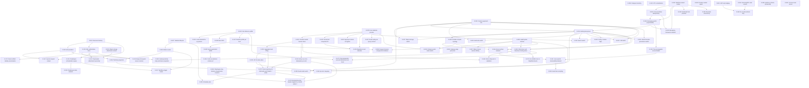

# Design Decisions - TaskFlow

This file records major design choices and dependencies made while scaffolding the TaskFlow reference app.

## Decision Dependency Graph

```mermaid
flowchart TD
    D001["D-001: Row-level tenancy"]
    D002["D-002: Auth providers"]
    D003["D-003: SQL authoritative store"]
    D004["D-004: TaskView projection"]
    D005["D-005: Object-storage attachment content"]
    D006["D-006: Broker events"]
    D007["D-007: TaskItem lifecycle"]
    D008["D-008: Category hierarchy"]
    D009["D-009: Scheduler jobs"]
    D010["D-010: Full reference profile"]
    D011["D-011: Local emulator/no-op posture"]
    D012["D-012: Polymorphic attachment ownership"]
    D015["D-015: FlowEngine orchestration engine"]
    D016["D-016: FlowEngine state isolation"]
    D017["D-017: Workflow trigger model"]
    D018["D-018: React SPA"]
    D019["D-019: Always Encrypted secure columns"]
    D020["D-020: Dual relational provider"]
    D021["D-021: Provider-neutral Version token"]
    D022["D-022: Tenant-first composite PK"]
    D023["D-023: App-layer column encryption"]
    D024["D-024: UTC normalization"]
    D025["D-025: Migrations reset baseline"]
    D026["D-026: TaskFlow-owned outbox"]
    D027["D-027: Read routing via Query context"]
    D028["D-028: Provider-neutral upsert"]
    D029["D-029: ConsumerInbox idempotency"]
    D030["D-030: Common-approach rule"]
    D031["D-031: Aggregate-level ETag"]
    D032["D-032: 412 for stale writes"]
    D033["D-033: Entity row is the idempotency record"]
    D034["D-034: Messaging switch (superseded)"]
    D035["D-035: Hosting-lane preset"]
    D036["D-036: Portable compute topology"]
    D037["D-037: Object-storage switch"]
    D038["D-038: Read-model switch"]
    D039["D-039: Audit-sink switch"]
    D040["D-040: Search switch"]
    D041["D-041: LLM switch"]
    D042["D-042: Config + feature flags"]
    D043["D-043: Data Protection persistence switch"]
    D044["D-044: Azure surface retained"]
    D045["D-045: Postgres pooler mode switch"]
    D046["D-046: Messaging framework retained"]
    D047["D-047: Runtime profile per host"]
    D048["D-048: Source-generated JSON"]
    D049["D-049: Health probe contract"]
    D050["D-050: Gateway edge protection"]
    D051["D-051: GET-only hedging"]
    D052["D-052: Distributed lock primitive"]
    D053["D-053: Trace propagation across brokers"]
    D054["D-054: Internal gRPC read service"]
    D055["D-055: Bounded concurrency"]
    D056["D-056: Cache serialization schema v2"]
    D057["D-057: Blazor Server session affinity"]
    D058["D-058: Audit key scheme (id-derived)"]
    D059["D-059: FlowEngine loop iteration id rejected as create id"]
    D060["D-060: Strict Azure and NonAzure hosting lanes"]
    D061["D-061: Lane-specific observability backend"]
    D062["D-062: In-house load runner"]
    D063["D-063: No unsafe-method retry"]
    D064["D-064: Request timeouts and graceful shutdown"]
    D065["D-065: Head trace sampling"]
    D066["D-066: Api error mapping"]
    D067["D-067: System request context"]
    D068["D-068: Gateway identity relay and token acquisition"]
    D069["D-069: Strict config and id validation"]
    D070["D-070: Uno WASM host on MapStaticAssets"]
    D071["D-071: Test prerequisite rule and default-lane test hosts"]
    D072["D-072: Fixed scaffold identity environments"]
    D073["D-073: Fresh-read retry for child adds and If-Match: * writes"]
    D074["D-074: Idempotency-Key header mapped to a stored UUIDv7"]

    D001 --> D002
    D001 --> D003
    D003 --> D004
    D003 --> D012
    D005 --> D012
    D007 --> D006
    D007 --> D009
    D006 --> D004
    D010 --> D011
    D003 --> D015
    D015 --> D016
    D015 --> D017
    D006 --> D017
    D010 --> D018
    D003 --> D019
    D020 --> D021
    D020 --> D022
    D020 --> D023
    D020 --> D025
    D020 --> D027
    D026 --> D029
    D022 --> D025
    D021 --> D031
    D031 --> D032
    D021 --> D033
    D026 --> D034
    D029 --> D034
    D030 --> D035
    D034 --> D035
    D035 --> D036
    D035 --> D037
    D030 --> D037
    D035 --> D038
    D004 --> D038
    D030 --> D038
    D035 --> D039
    D030 --> D039
    D035 --> D040
    D020 --> D040
    D030 --> D040
    D035 --> D041
    D030 --> D041
    D035 --> D042
    D035 --> D043
    D030 --> D043
    D035 --> D044
    D036 --> D044
    D020 --> D045
    D036 --> D045
    D026 --> D046
    D029 --> D046
    D034 --> D046
    D010 --> D047
    D047 --> D048
    D049 --> D050
    D026 --> D052
    D034 --> D053
    D026 --> D055
    D048 --> D056
    D049 --> D057
    D035 --> D060
    D036 --> D060
    D049 --> D060
    D053 --> D061
    D060 --> D061
    D051 --> D063
    D054 --> D063
    D047 --> D064
    D049 --> D064
    D061 --> D065
    D032 --> D066
    D049 --> D066
    D001 --> D067
    D002 --> D067
    D002 --> D068
    D050 --> D068
    D060 --> D069
    D021 --> D069
    D060 --> D070
    D060 --> D071
    D002 --> D072
    D031 --> D073
    D032 --> D073
    D033 --> D073
    D073 --> D009
    D033 --> D074
    D059 --> D074
    D073 --> D074
    D010 --> D071
```

## Decisions

| ID | Branch | Decision | Selected Option | Depends On | Status | Rationale | Affects |
|---|---|---|---|---|---|---|---|
| D-001 | Tenancy | Tenant isolation model | Row-level tenancy | none | confirmed | Demonstrates tenant filters, tenant boundary validation, and global-admin bypass without multiplying schemas/databases. | Phase 1, Phase 2, Phase 5a, Phase 5b, Phase 5e |
| D-002 | Auth | Auth scenario | Automatic scaffold principal for the reference proof; live `EntraID`/`EntraExternal` remains deployment-only | D-001 | confirmed | The reference app must boot and exercise every protected surface without a login or cloud identity. `AuthMode: Scaffold` is the supported proof path; interactive provider registration, client login UI, and live-token acceptance are production deployment work, not reference-app test prerequisites. | Phase 5e |
| D-003 | Data | Authoritative entity store | SQL Server or PostgreSQL (D-020) for all authoritative entities | D-001 | confirmed | Relational joins are needed for hierarchy, task/category references, and many-to-many tags. | Phase 2, Phase 5a |
| D-004 | Data | Read model projection | Lane-owned `TaskView` projection: PostgreSQL JSONB on NonAzure (default), Cosmos DB on Azure (D-038, D-060) | D-003, D-006 | confirmed | Demonstrates denormalized query model and reconciliation pattern. | Phase 5b, post-phase hardening |
| D-005 | Storage | Attachment content store | Object storage: S3-compatible on NonAzure (default), Azure Blob on Azure (D-037, D-060) | D-003 | confirmed | Binary content belongs in object storage; domain keeps metadata and URI. | Phase 2, Phase 5b |
| D-006 | Messaging | Domain event transport | Lane broker with at-least-once semantics: RabbitMQ on NonAzure (default), Service Bus on Azure (D-060) | D-007 | confirmed | Demonstrates event-driven projection and async host processing. | Phase 2, Phase 5b, Phase 5c |
| D-007 | Lifecycle | Task lifecycle | `Open -> InProgress -> Blocked/Completed/Cancelled`, reopen from completed/cancelled | none | confirmed | Captures realistic task workflow and supports rule tests. | Phase 1, Phase 5a |
| D-008 | Relationships | Category hierarchy depth | Self-referencing category tree, max five levels | none | confirmed | Allows business grouping while bounding query/UI complexity. | Phase 1, Phase 5a, UI |
| D-009 | Workflows | Scheduled jobs | Overdue check, recurring task generation, stale cleanup, plus four retention sweeps. Cron schedules are declared on `[TickerFunction(name, cron)]`, so TickerQ seeds them idempotently when the host runs, inside the `EF.BackgroundServices.TickerQ` seed lock; each job runs its handler through `ScheduledJobRunner`; `AddSchedulerHealthCheck<TaskFlowTickerQDbContext>` reports Degraded when no job has run within `Scheduling:Health:StallThreshold` (12 h); the `EF.Host` App Configuration refresher polls in the background because the Scheduler has no request middleware. Each multi-statement job step runs through `ITaskItemSystemRepository.ExecuteInTransactionAsync<T>` (EF.Data `ResilientTransaction`: execution strategy plus transaction), which refuses pending changes, clears the change tracker at the start of every attempt and returns the committed attempt's result; the handler adds that result to its count after the call returns. A retry after a lost commit re-runs the guards, upsert and staging against the rolled-back rows; a retry after a commit that landed is a no-op through the same guards (the overdue marks and the template advance return false, the stale tasks are gone) and reports 0, so the job's rows-affected undercounts that step rather than double counting. Saves inside keep `acceptAllChangesOnSuccess: true`: deferring `AcceptAllChanges` would leave the first attempt's rows tracked as Added, and the re-staged rows would collide with them. A job stages a deterministic id only for a row its own guarded write changed, never after a count-only guard: the overdue mark is one guarded `ExecuteUpdate` per task (a row another replica marked first returns false and is not announced again), and the recurrence inserts each occurrence with its own insert-if-absent upsert and announces and counts only the ones inserted (a pointer re-seeded over generated occurrences, as re-attaching a pattern does, re-walks rows that exist), and the stale cleanup deletes each task under its stale guard and queues blob-delete work, and deletes the attachment rows, only for the tasks that delete removed (two overlapping runs no longer both queue the same work ids, and a task reopened between scan and delete keeps its attachments). `RETURNING` would say which rows one statement changed, but it is not portable through `ExecuteUpdate` on both providers. | D-007, D-006, D-073 | confirmed | Exercises scheduler, the lane broker, and domain-service reuse. Seeding through `ICronTickerManager.AddAsync` before the host runs fails every call (TickerQ builds its function table in `RunAsync`), so no job ever ran; `SchedulerCronSeedingTests` proves seven rows after start and none added by a restart. Before the per-attempt clear, a commit retried after a transient failure threw "already being tracked" on the re-staged outbox or blob-delete row in all three jobs; `Test.Integration/SchedulerTransactionRetryTests.cs` injects one provider-transient exception before and after the commit on PostgreSQL and SQL Server. Staging every row of a tenant group after a non-zero mark count failed the run on `PK_OutboxMessage` when a competing replica had marked part of the page, so did staging every occurrence after a re-seeded pointer, and stale cleanup failed on `PK_BlobDeleteWork` when an overlapping run had removed part of the batch; the same class stages both on PostgreSQL and SQL Server. | Phase 5c |
| D-010 | Profile | Reference app scope | Full scaffold, comprehensive tests, optional hosts enabled | none | confirmed | Reference app must prove every major instruction pattern - once, not per entity. Deliberate per-entity asymmetry: `StructureValidator` on aggregate roots only (TaskItem, Category, Tag, Attachment), `CommandValidators` and a standalone updater on TaskItem only (sole aggregate with child collections), dedicated `RepositoryTrxn` on aggregate roots per GR-15; simple children (Comment, ChecklistItem) use generic repositories and inline updates. | All phases |
| D-011 | Local dependencies | Local boot strategy | Emulators where available; no-op/lazy-optional for deployment-only services | D-010 | confirmed | Scaffold must run locally without Azure provisioning. | Phase 3, Phase 5b, Phase 5e |
| D-012 | Relationships | Attachment ownership | Polymorphic `OwnerType` + `OwnerId`, no owner navigation collections | D-003, D-005 | confirmed | Avoids conflicting FK constraints for shared attachment ownership. | Phase 1, Phase 2, Phase 5a |
| D-015 | Orchestration | Workflow engine selection | `EF.FlowEngine` (SQL state store, outbox, circuit breaker, admin API, Blazor dashboard; version pinned in `Directory.Packages.props`) | D-003 | confirmed | Demonstrates durable AI-driven orchestration with human-in-loop, sagas, and atomic outbox. Reuses existing SQL Server + Azure OpenAI; no new infrastructure resource. Three workflows shipped: `ai-task-triage`, `ai-task-decomposer`, `compliance-check`, plus the `compliance-check-item` child workflow. Workflow nodes use only the registered `taskflow-api`, `integration-events` and `ai-agent` clients, and JSON seeding saves every definition through the engine's validating registry, which rejects an unregistered clientRef or an unknown node config key, so a bad definition stops host start: `FlowEngineClientRegistrationTests` resolves every shipped clientRef against the application registrations on both lanes (RabbitMQ and Service Bus) and shows an unregistered one is reported as `CLIENT_NOT_REGISTERED`, and `WorkflowDefinitionValidityTests` shows an unknown config key fails validation. An inline loop (`bodyEntryNodeId`) runs one node per iteration and writes the iteration keys into the instance context, so a multi-node per-item flow is a child workflow (`subWorkflowId`), each child its own instance with the item in `params.currentItem`. `compliance-check` searches one page (50) of the started tenant's tasks due before `dueBefore` through the public API (the search has no tag filter and filters status by equality only, so completed tasks are included) and starts one `compliance-check-item` per task, at most 5 in parallel; the child's evidence `document` node takes its Error edge because TaskFlow registers no `IDocumentStore`, and the decision's default edge also covers no finding. `AiWorkflowIntegrationTests.ComplianceCheck_ScansOnlyTheStartedTenant_AndRemindsTheTaskWithExpiringEvidence` runs both definitions end to end with a test document store. | Phase 5e+, Section 14 |
| D-016 | Data | FlowEngine state isolation | Separate `flowengine` schema in same SQL DB, separate `TaskFlowFlowEngineDbContext` implementing all three FE mixins, separate `__EFMigrationsHistory_FlowEngine` table | D-015 | confirmed | Variant A from gap-analysis: atomic outbox preserved (single `SaveChangesAsync` writes state + outbox). Sidesteps multi-inheritance conflict with `EF.Data.DbContextBase<TUser,TKey>` (audit interceptor base). Schemas evolve independently. | Section 14, Bootstrapper |
| D-017 | Orchestration | Workflow trigger model | Workflows started via `IWorkflowTrigger` (manual today); event-driven wiring left to integrator | D-015, D-006 | confirmed | Reference app demonstrates the trigger surface without prescribing one auto-fire pattern. Three viable wirings documented (Section 14.6): Service Bus subscriber, inline service call, TickerQ cron job. | `WorkflowTriggerHandler`, future Functions |
| D-018 | UI | React SPA | `src/UI/TaskFlow.React` Vite/React SPA wired via `AddViteApp` in the AppHost (`includeReactUI: true`); intentionally not a `.slnx` member (Vite app, not a .NET project) | D-010 | confirmed | Proves the third UI pattern (`includeReactUI`) alongside Blazor and Uno. Built/tested via `npm ci` in CI and `Test.PlaywrightUI`. | CI, `Test.PlaywrightUI`, AppHost |
| D-019 | Security | Column-level encryption for sensitive properties | SQL Always Encrypted on `TaskItem.SecureDeterministic` (DETERMINISTIC) and `TaskItem.SecureRandom` (RANDOMIZED); CMK/CEK created in `InitialCreate` via `EF.Data.MigrationSupport`, CMK stored as an Azure Key Vault RSA key. Local build/test/run stay green because the AKV setup is gated by `SKIP_ALWAYS_ENCRYPTED_SETUP` (default skipped -> plain `varbinary(200)` columns); the full path is opt-in via `TASKFLOW_ENABLE_ALWAYS_ENCRYPTED` on the Aspire AppHost. | D-003 | confirmed | Demonstrates the standard EF-Core-plus-raw-SQL Always Encrypted pattern (no fluent support) while preserving the reference-app "no cloud required locally" invariant. Deterministic column shows equality querying; randomized shows non-queryable at-rest protection. | Phase 5a, `infra/`, AppHost |
| D-020 | Data | Relational database provider | Dual provider: SQL Server or PostgreSQL, `Database:Provider = SqlServer \| PostgreSql` selects the provider for all four contexts (Trxn, Query, FlowEngine, TickerQ) and the migrator; both first-class and CI-tested | D-003 | confirmed | Proves the scaffold is not SQL-Server-locked; PostgreSQL is a common customer-selected target. `databaseProviders: [SqlServer, PostgreSql]` added to `resource-implementation.yaml`. | Phase 1, Phase 5a, D-003 amended |
| D-021 | Data | Optimistic concurrency token | Provider-neutral app-managed `long Version` concurrency token (`IsConcurrencyToken()`, incremented in the base context `SaveChanges` for modified roots) replacing `rowversion` | D-020 | confirmed | Same ETag value on both providers; works on the InMemory provider so Test.Unit can cover 412 paths (`ETag: "<Version>"`, strong). Alternative rejected: provider-native `rowversion`/`xmin` (different types, untestable in-memory, opaque ETags). `EF.Domain.EntityBase<TId>.Version` is the token; `EF.Data.DbContextBase` sets it to 1 on insert, increments it for modified entries, and stamps `CreatedAtUtc`/`ModifiedAtUtc` (`ITimestampedEntity`) from its clock. | Phase 1, Phase 2, D-031, D-033 |
| D-022 | Data | Primary key shape | Tenant-first composite primary keys `(TenantId, Id)` on every tenant entity, composite FKs `(TenantId, ParentId)` to children | D-020, D-001 | confirmed | On SQL Server this is the clustered index (drops the separate `CIX_*` indexes); on Postgres it makes every table distributable by `TenantId` (Citus/Azure PostgreSQL elastic clusters require the distribution column in the PK and unique constraints) without a future rewrite. Global-admin cross-tenant queries still work (no partition pruning, acceptable for system jobs). | Phase 1, D-025 |
| D-023 | Security | Column-level encryption for sensitive properties | One application-layer AES-256-GCM value converter for BOTH providers on randomized columns; deterministic equality via an HMAC-SHA256 blind-index sibling column (`SecureDeterministicHash`, indexed), ciphertext stored randomized; both secure properties and the blind-index shadow column are marked `IsSensitive()`, which the `EF.Data` audit interceptor masks on insert and update payloads, so the audit trail never stores their plaintext; data-encryption key wrapped by an Azure Key Vault RSA key (RSA-OAEP), cached in memory, local dev uses a config-provided key | D-020, D-003 | confirmed | User preference: one common approach across both providers rather than a provider-specific mechanism. Domain byte budget stays 200 plaintext bytes; storage column is `varbinary(max)`/`bytea` (GCM overhead: nonce 12 + tag 16). Supersedes D-019 (kept as a documented SQL-Server-only alternative in tech-design with a code comment at the converter registration). Consequence: EF.Data core drops SqlClient/Always Encrypted dependencies. | Phase 1, Phase 5a, D-019 superseded |
| D-024 | Data | Temporal value normalization | All `DateTimeOffset` and `DateTime` values normalized to UTC by `EF.Data` `RegisterUtcTemporalConversions` on both providers (an `Unspecified` `DateTime` is taken as UTC); new scale columns are named `*Utc` | D-020 | confirmed | Npgsql `timestamptz` rejects non-zero offsets; one converter keeps both providers on a single code path. Client display converts. | Phase 1 |
| D-025 | Data | Migration baseline | Exactly one initial migration per (context x provider) = 6, in two migration assemblies (`TaskFlow.Infrastructure.Data.Migrations.SqlServer`, `...Migrations.PostgreSql`) selected via `MigrationsAssembly`: `InitialCreate` (TaskFlow), `InitialFlowEngine`, `InitialTickerQ`. The rule is permanent: TaskFlow is the foundation new apps start from, so it never carries migration history, and a schema change regenerates the context's initial migration (delete it with its Designer file and snapshot, then `dotnet ef migrations add` it again per provider) instead of adding one. `Test.Architecture/MigrationBaselineArchitectureTests` fails when any context and provider pair has more than one migration, and `has-pending-model-changes` stays clean for all six pairs. A regeneration invalidates an existing database's migration history, so a local dev volume (`taskflow-postgres-data`, `taskflow-sql-data`) is dropped and recreated rather than upgraded (README). | D-020, D-022 | confirmed | A baseline with history would hand every new app the upgrade path of a schema it never had; data backfills and type conversions exist only to move an existing database, and a fresh baseline has none. The 2026-10-01 regeneration folded eight PostgreSQL and six SQL Server TaskFlow migrations (read model and audit, embeddings, jsonb, two-state inbox, audit start time, package inbox and outbox) and the D-074 idempotency-key table into `InitialCreate`, and removed the tests that proved the folded backfills. `migrationLifecycle` in `resource-implementation.yaml`; `TaskFlowMigrationHistoryCompatibility.cs` deleted. | Phase 1, 2026-10-01 |
| D-026 | Messaging | Transactional outbox ownership | TaskFlow's own transactional outbox + work tables (not FlowEngine's), built on `EF.Data.Outbox`: `OutboxMessage` and `BlobDeleteWork` (`LeasedWorkItem`) map into the TaskFlow write context (`ApplyOutboxModel`), `AddOutbox<TaskFlowDbContextTrxn>` stages domain events through `TaskFlowOutboxEventMapper` (envelope plus a `TenantId` header), and the Scheduler runs `AddOutboxDispatcher` over the lane's `IOutboxTransport`; the claim is provider-neutral EF Core (select candidate Ids, conditional lease-claim update, then read owned rows) | none | confirmed | A racing replica simply claims fewer rows. Single-statement provider-specific upgrade paths (SQL Server `UPDATE TOP...OUTPUT`, Postgres `FOR UPDATE SKIP LOCKED`) are documented only as code comments. Payload is a JSON string column via EF (`jsonb`/`nvarchar(max)`). Scheduler host drains both replicas, lease-based, adaptive poll. Claims skip rows at the configured `MaxAttempts` and dead-letter exhausted rows whose lease expired; transports return one result per message and each row settles on its own result on a bounded token that shutdown does not cancel, so one bad message never fails its destination group and a send the broker accepted is not re-published after a shutdown. | Phase 3, D-029 |
| D-027 | Data | Read routing | The Query context keeps its own connection string on both providers; SQL Server appends `ApplicationIntent=ReadOnly` (Hyperscale HA secondary), Postgres points at the Flexible Server read-replica endpoint | D-020 | confirmed | Reads that follow a write in the same request use the Trxn context (read-your-writes rule); replica lag is otherwise acceptable for read-model queries. | Phase 1, Phase 5a |
| D-028 | Data | Provider-neutral upsert | `EF.Data` `IRepositoryBase.UpsertAsync`/`UpsertRangeAsync(entity, match, whenMatched)` (FlexLabs.EntityFrameworkCore.Upsert under the hood: `MERGE` on SQL Server, `ON CONFLICT` on Postgres) for idempotent create-if-absent | D-026 | confirmed | Avoids hand-written provider-specific upsert SQL for outbox rows and recurrence occurrences. The package owns the FlexLabs dependency, so no repository takes it directly; a null `whenMatched` is DO NOTHING (inbox claim, occurrences, audit append) and an explicit one replaces every non-key column (read-model and embedding upserts). | Phase 1, Phase 3 |
| D-029 | Messaging | Consumer idempotency | Two-state inbox `ConsumerInbox (Consumer, MessageId, ClaimToken, ClaimedAtUtc, LeaseExpiresUtc, CompletedAtUtc)`, PK `(Consumer, MessageId)`. A delivery claims with a 60 s lease that it renews every 20 s while the handler runs, completes after the work, and releases on failure (token-guarded). A redelivery that finds a live claim polls it (`WaitPollInterval` 1 s, bound lease + 5 s): completed means ack as a duplicate, expired means take over, still live returns `ConsumeDisposition.InProgress`, which the transport retries. The consumers derive from `EF.Messaging` `IntegrationEventConsumerBase` over the `EF.Data.Outbox` `InboxStore<TaskFlowDbContextTrxn>` on the same `ConsumerInbox` table (`Consumer` up to 128 characters). A holder stops renewing after `MaxClaimDuration` (package default 10 min, kept: every TaskFlow consumer handler finishes well inside it), so a hung handler's claim lapses and a redelivery takes over. Timings bind from `Messaging:Inbox`; completed and abandoned rows are hard-deleted by retention. | D-020 | confirmed | A claim committed before the work loses the effect on a crash or a concurrent redelivery. The bounded wait exists because RabbitMQ (the default broker) requeues a retry immediately, which would dead-letter the message after a consumer crash while the dead holder's lease is still live. Provider-neutral; FlowEngine `StartRequest.IdempotencyKey` is set as well. | Phase 3, D-026 |
| D-030 | Data | Provider-branch discipline | Provider branches exist only where EF Core forces them (`UseSqlServer`/`UseNpgsql`, per-provider migration assemblies, the PostgreSQL-only column types in `TaskFlowDbContextBase.ConfigurePostgreSqlModel` (`jsonb`, `vector`), the SQL Server binary collation on the D-074 key columns in `IdempotencyKeyConfiguration`, Npgsql UTC requirement); model-wide conventions (`HavePrecision(18, 4)`, UTC converters) are provider-neutral in `ConfigureConventions`; everything else is one code path with a comment naming the provider-specific customization | D-020 | confirmed | Keeps the dual-provider surface maintainable; prevents provider-branch sprawl in `OnModelCreating`. | Phase 1 |
| D-031 | Data | Concurrency scope | Aggregate-level ETag: root `TaskItem.Version` is the ETag; child mutation methods call a private `MarkAggregateChanged()` that touches `ModifiedAtUtc` so the root is marked Modified and its `Version` bumps; child PUT/DELETE use the root ETag | D-021 | confirmed | One concurrency currency per aggregate avoids per-child ETag bookkeeping. Child DTOs still expose their own `Version` for display, not as If-Match currency. | Phase 2, D-032 |
| D-032 | Data | Concurrency conflict status code | 412 (not 409) for stale writes: `EF.Data.Contracts.ConcurrencyGuard.Require` and every `OptimisticConcurrencyWinner.Throw` save raise `PreconditionFailedException`, which the `EF.AspNetCore.Concurrency` If-Match filter answers with 412 and the current ETag; a policy-free save's `DbUpdateConcurrencyException` is classified 412 as well; 428 when `If-Match` is missing (`RequireIfMatch()`); `If-Match: *` is the explicit trusted-automation override, sent by each FlowEngine PATCH node's own `"headers"` config (`EF.FlowEngine.Definition.NodeConfigs.IntegrationNodeConfig.Headers`, forwarded by `IntegrationNodeExecutor`); a `*` write states no precondition, so it never answers 412: it reaches the write as `expectedVersion == null`, the guard passes, and the read, apply and save run inside the D-073 fresh-read retry, so a write that lands between the read and the save makes it re-read and apply again, and a race lost on every attempt is 409. A `*` PUT is a full replacement of the aggregate as re-read, so a child added concurrently and not in the payload is deleted with the replace; a `*` PATCH changes only the fields it carries. The node `retryPolicy` is the only retry owner (the `taskflow-api` client sends once per node attempt, D-063), and every `taskflow-api` node, loop-body nodes included, declares one (3 attempts, exponential backoff), so a `*` PATCH is resent on 409, 429 and 503 (the engine's unsafe-method default) and never on 412: the engine treats 412 as permanent, and its definition validator refuses 412 in any retry list | D-031 | confirmed | 412 Precondition Failed is the correct HTTP semantics for a stale If-Match. A wildcard caller named no version, so a 412 would report a precondition it never sent. The FlowEngine override is node config, so no app-side transport handler exists. Resending a stale If-Match unchanged cannot succeed, while 409/429/503 on a `*` write are transient. `WorkflowDefinitionValidityTests` pins each node's policy and the absence of 412; `FlowEngineWorkflowTests` shows a 503 PATCH resent once and a 412 PATCH sent once. The 412 carries the current ETag only from the If-Match filter (`PreconditionFailedException.Current`): `ExceptionHandlerMiddleware` clears response headers, so a 412 raised outside the filter has none. | Phase 2, handler mitigation superseded |
| D-033 | Data | Idempotent create record | No response-replay table: an optional caller-supplied UUIDv7 id, the entity row itself is the idempotency record; equivalent replay returns 200 + existing entity + ETag, divergent payload is a 409 (`EF.Common.Contracts.ConflictException`) | D-021 | confirmed | Avoids a second source of truth for create idempotency. Equivalence is a scalar-field compare ignoring Id/Version/TenantId/children (documented limitation), made against the request as the create applied it: a Category create always stores `IsActive = true`, so the request's `IsActive` counts as true, and a TaskItem create drops the recurrence fields unless both interval and frequency are present, so they count as dropped (`IdempotentCreateReplayEndpointTests`: an identical resend replays, a different value is 409; before, the identical resend was 409). The Tag, Attachment, Comment and ChecklistItem creates store every compared field as sent. Values are normalized to their stored precision in the domain (`StoredPrecision`, `DomainConstants.EFFORT_SCALE`): TaskItem effort rounds to two decimals (`MidpointRounding.AwayFromZero`, matching `HasPrecision(10, EFFORT_SCALE)`) and StartDate/DueDate truncate to whole microseconds (PostgreSQL precision; offset kept) on every setter path, so the domain value equals the stored value on both providers and the replay compare normalizes the resend through the same helpers (`IdempotentCreateReplayEndpointTests`: an identical resend with effort 1.23456 or sub-microsecond ticks replays and returns 1.23 / the truncated date; before, the stored row differed from the resend). Category, Tag, Attachment, Comment and ChecklistItem compare no decimal or timestamp. A create that loses the insert race to the same caller id re-reads on the query context: an equivalent row replays, a different row is 409. D-074 adds only a header-key-to-id map; the entity row stays the idempotency record. | Phase 2, D-074 |
| D-034 | Messaging | Historical messaging provider switch | Superseded by D-060. The application transport port still supports Service Bus and RabbitMQ, but a deployed lane cannot flip brokers independently: Azure always owns Service Bus and NonAzure always owns RabbitMQ. | D-026, D-029 | superseded | Strict lane ownership prevents Azure and NonAzure infrastructure from mixing. RabbitMQ consumers remain hosted in Scheduler; Azure Service Bus consumers remain in Functions. | Phase 3.7, D-060 |
| D-035 | Hosting | Hosting-lane preset | Superseded by D-060. Historical decision retained: `TASKFLOW_LANE = Azure \| Portable` seeded independent switch defaults. | D-030, D-034 | superseded | Replaced by the strict Azure/NonAzure contract; the `Portable` spelling remains only as a one-release input alias. | P2, P6, AppHost |
| D-036 | Hosting | NonAzure compute topology | Docker Compose on one VPS with Caddy as the TLS edge in front of the YARP gateway; hand-written files under `deploy/compose/` | D-035 | confirmed | Matches the target topology without an IaC generator dependency. The NonAzure lane retains this shape; Aspire, Testcontainers, Bicep, Compose, and all UIs share the D-060 lane contract. Rejected: Aspire publish to Compose (new `Aspire.Hosting.Docker` dependency, generated IaC harder to hand-tune); k3s/Swarm kept as a documented multi-node upgrade path. | P6 |
| D-037 | Storage | Object-storage provider switch | `Storage:Provider = AzureBlob \| S3` behind the unchanged `EF.Storage.Contracts.IObjectStorageRepository`; S3 arm is the published `EF.Storage.S3.S3ObjectStorageRepository` (SeaweedFS locally/on the VPS, any S3-compatible provider in production); download URLs are presigned against a public endpoint | D-035, D-030 | confirmed | Keeps the attachment port provider-neutral without a second abstraction. SeaweedFS replaces MinIO for the NonAzure S3-compatible service. Rejected: an S3-to-Blob gateway container (extra moving part, still needs a real switch underneath). | P2, P4 |
| D-038 | Data | Read-model provider switch | `ReadModel:Provider = Cosmos \| PostgreSqlJsonb \| MongoDb`; NonAzure defaults to PostgreSQL JSONB and permits explicit MongoDB; legacy `Relational` is a one-release alias for `PostgreSqlJsonb`. The relational arm remains a `TaskView` table in the `taskflow` schema with provider-native JSON body storage, counters patched via one `ExecuteUpdateAsync`, and opaque keyset paging. | D-035, D-004, D-030 | confirmed | Reuses the existing Cosmos projection contract instead of forking it while making the PostgreSQL JSONB and MongoDB provider choices explicit. This supersedes only the old provider value set; the previous `Relational` value is retained only for compatibility. | P2, P3 |
| D-039 | Data | Audit-sink provider switch | `Audit:Provider = AzureTable \| Relational`; relational arm keyed `(TenantId, RecordedUtc, Id)`, retention via `ExecuteDeleteBatchedAsync`; both arms implement `EF.Audit.Contracts.IAuditLogRepository` | D-035, D-030 | confirmed | Same switch shape as the read model, no new pattern. Azure uses Azure Table and NonAzure uses relational audit. Rejected: Azurite as the NonAzure audit sink (still Azure-shaped, does not prove a non-Azure path). See D-058 for recordedUtc/key derivation and package decisions. | P2, P3 |
| D-040 | Search | Search provider switch | `Search:Provider = AzureAiSearch \| PgVector \| Sql`; `PgVector` requires `Database:Provider = PostgreSql` and fails fast at startup otherwise | D-035, D-020, D-030 | confirmed | Local search defaults to `Sql`; AzureAiSearch is a compatible live Azure opt-in, while PgVector is a compatible NonAzure opt-in. A vector search arm should be loud when its prerequisite provider is missing, not silently degrade. Rejected: silent downgrade to `Sql` prefix search; a dedicated vector database (new infrastructure for a proof). | P2, P7 |
| D-041 | AI | LLM provider switch | `AiServices:Provider = AzureInference \| OpenAICompatible \| None`; local default is `None`; AzureInference is a compatible live Azure opt-in, and OpenAICompatible is the compatible NonAzure opt-in. The resolved provider is the only switch: the AppHost wires Azure Foundry only for `AzureInference`, and Foundry settings (`ConnectionStrings:chat`, `AiServices:FoundryEndpoint`, `AiServices:AgentModelDeployment`) under any other provider fail the graph build with a diagnostic naming them | D-035, D-030 | confirmed | One SDK covers every OpenAI-compatible vendor rather than one integration per vendor. Rejected: per-vendor SDKs (N integrations for the same wire protocol) and native local-model runtimes with fragile lifecycle management. | P2, P5 |
| D-042 | Config | Config and feature-flag provider | Azure App Configuration + `Microsoft.FeatureManagement` is an Azure live opt-in, gated on `AppConfig:Endpoint`; NonAzure rejects non-empty Azure App Configuration configuration and uses appsettings/environment. Sentinel-key refresh, Key Vault references, and tenant `TargetingContext` apply only when the Azure opt-in is selected. `WithTargeting` registers the targeting accessor as a singleton, so it resolves `IRequestContext` per call from the current request's services (a fresh scope, and therefore the system context, when there is no request) instead of caching the first caller's context. | D-035 | confirmed | Dynamic flags need a real flag service in Azure; zero-Azure NonAzure must remain deployable without Azure configuration. Rejected: silently accepting Azure endpoints in NonAzure; a self-hosted flag service (new infrastructure for a proof). | P5 |
| D-043 | Security | Data Protection persistence switch | `DataProtection:Persistence = AzureBlob \| Redis \| None`; Azure uses Blob Data Protection and NonAzure uses Redis Data Protection; `None` logs a warning because payloads break across replicas | D-035, D-030 | confirmed | Persistence and protection are separable; only persistence needs a NonAzure arm. Rejected: a file-share ring (single point of failure, no multi-VPS story); an ephemeral ring as the default (silently breaks multi-replica cursors). | P2 |
| D-044 | Hosting | Azure surface retained in the Portable lane | Superseded by D-060. Historical decision retained: Azure Key Vault and App Configuration remained available in Portable. | D-035, D-036 | superseded | NonAzure is now a zero-Azure lane: non-empty Azure App Configuration and Key Vault service configuration is rejected. Azure App Configuration and Key Vault remain Azure live opt-ins; NonAzure uses appsettings/environment and the existing local encryption-key path. | P6, docs |
| D-045 | Data | Postgres pooler mode switch | `Database:PostgreSql:PoolerMode = None \| Transaction`; `Transaction` appends `No Reset On Close=true;Max Auto Prepare=0` to the Npgsql connection string; NonAzure runs a PgBouncer container | D-020, D-036 | confirmed | Transaction-mode pooling is the throughput-relevant PgBouncer mode and needs explicit connection-string cooperation from Npgsql. Rejected: session-mode-only pooling (does not multiplex connections, defeats the purpose at scale). | P2, P6, Bicep |
| D-046 | Messaging | Messaging framework retained | The `EF.Data.Outbox` outbox and inbox with the `EF.Messaging` `IOutboxTransport` implementations (Service Bus, and RabbitMQ from `EF.Messaging.RabbitMq`) stay the transport layer; MassTransit and SlimMessageBus are not adopted. Service Bus is Azure's broker; RabbitMQ is NonAzure's. Every RabbitMQ queue is a quorum queue (`x-queue-type=quorum`, `TaskFlowRabbitMqTopology.QuorumQueueArguments`); a broker still holding the classic queues needs them deleted once before upgrade (`deploy/compose/README.md`). | D-026, D-029, D-034 | confirmed | The outbox and consumer host already exist and work on both brokers; a framework would duplicate both. Quorum queues carry the broker delivery count, so `MaxDeliveryCount` bounds a retrying message across Scheduler replicas; a classic queue bounds it only per replica (EF.Messaging.RabbitMq M19). Rejected: MassTransit and SlimMessageBus (would duplicate the existing outbox and consumer host). | P1 |
| D-047 | Runtime | Runtime profile per host | Shared runtime profiles remain in force for API, Gateway, Scheduler with embedded TickerQ, Blazor, Uno, and Azure-only Functions; DatabaseMigrator keeps its short-lived workstation profile | D-010 | confirmed | Matches each host's actual workload shape instead of one blanket GC setting. Native AOT remains deferred because EF Core, TickerQ, and FlowEngine are reflection-based. | G1, F1 |
| D-048 | Serialization | Source-generated JSON | One `TaskFlowJsonContext : JsonSerializerContext` remains registered across runtime, messaging, cache, and UI resolver chains; reflection stays after it for third-party types. | D-047 | confirmed | Source generation is the low-risk, high-value half of the AOT story even where full AOT is deferred. Queue payload stays JSON; binary serialization remains scoped to the L2 cache value. | G1 |
| D-049 | Observability | Health probe contract | `/healthz/live` (self only), `/healthz/ready` (database, outbox, scheduler, broker on consumer hosts; cache excluded because it degrades to L1), `/healthz` aggregate for humans and Compose healthchecks; `/readyz` removed | none | confirmed | Liveness must never fail on a dependency a restart cannot fix; readiness is where dependency checks belong. The probes are shared across Azure and NonAzure lanes. Rejected: a single combined probe; keeping `/readyz` alongside `/healthz/ready`. | G2 |
| D-060 | Hosting | Strict Azure and NonAzure hosting lanes | Canonical `TASKFLOW_LANE = Azure \| NonAzure`; `Portable` is a deprecated input alias for `NonAzure` for one release. NonAzure is the default lane when `TASKFLOW_LANE` / `Hosting:Lane` is unset; Azure is the explicit opt-in, and every Azure-deployed host (Bicep container apps, migrator job, Functions) sets `Hosting__Lane=Azure` itself. Azure owns SQL Server, Service Bus, Azure Blob, Cosmos, Azure Table, and Blob Data Protection. NonAzure owns PostgreSQL, RabbitMQ, S3, relational audit, PostgreSQL JSONB read model by default, and Redis Data Protection; MongoDB is an explicit compatible opt-in. Lane-owned core provider conflicts fail fast. NonAzure is zero-Azure: non-empty Azure App Configuration and Key Vault service configuration is rejected; it uses appsettings/environment and the existing local encryption-key path. Azure App Configuration and Key Vault remain Azure live opt-ins. Redis, DatabaseMigrator, API, Gateway, Scheduler with embedded TickerQ, Blazor, React, and Uno are common; Functions is Azure-only. Local search defaults to Sql and AI defaults to None; opt-ins must be lane-compatible. SeaweedFS replaces MinIO. Major/family image tags are centralized. Aspire, Testcontainers, Azure Bicep, Compose, and all three UIs share the lane contract; expensive full-lane/UI acceptance is manual. | D-035..D-049 | confirmed | Makes lane ownership explicit while preserving confirmed provider, runtime, serialization, and health decisions; D-034, D-035, D-044, and the old D-038 value set are superseded. | P2, P6, AppHost, Bicep, Compose, UI |
| D-061 | Observability | Lane-specific observability backend | Local development exports OpenTelemetry to the Aspire Dashboard only. Deployed NonAzure runs pinned OpenObserve OSS v1.0.0 in its own persistent container for OTLP logs and traces; metrics export is disabled by default, retention is short and operator-configurable, and the UI binds to a private/loopback interface by default. All ProblemDetails responses expose the server request identifier as `requestId` and W3C `traceId`/`spanId` fields that correlate exceptions, logs, and traces across HTTP and broker hops. Applications export directly through the OpenTelemetry SDK; an OpenTelemetry Collector is a later opt-in only if tail sampling becomes necessary. | D-053, D-060 | confirmed | This is the minimum self-hosted diagnostic surface that supports exception investigation and cross-service request tracing without ingesting low-value metrics. OpenObserve Open Source Edition is AGPL-3.0; hosted and enterprise offerings have separate terms. The selected single-node deployment is a low-license-cost baseline, not high availability. Rejected: deployed `otel-lgtm` because that image is a development/demo stack; always-on metrics; adding a Collector before a concrete sampling need exists. | Compose, ServiceDefaults, exception handling, operations docs |
| D-050 | Edge | Gateway edge protection | Token-bucket rate limiter per client IP plus a concurrency limiter for proxied traffic at the Gateway, validated at registration, in addition to the Api's Redis tenant limiter. The Api limiter (`EF.RateLimiting` `AddTenantRateLimiting`, section `RateLimiting:Tenants`) runs after authentication and authorization so partitions see the tenant claim, each request counts against exactly one tenant budget (the export route only against its `export` budget via `RequireTenantBudget`), and with Redis present `EF.RateLimiting.Redis` keeps the budgets on the cache's shared multiplexer and fails open (`ratelimit.backend_failure`). The Gateway edge limiter is `UseEdgeLimiter` (section `RateLimiting:Edge`). The deployed Gateway applies forwarded headers (`TrustAllProxies` with `ForwardLimit=1` behind Container Apps ingress, which has no VNet) so the per-IP partition is the client address; YARP cluster gets active health on `/healthz/ready`, passive transport-failure health, `PowerOfTwoChoices` load balancing, and an activity timeout | D-049 | confirmed | The Api limiter protects tenants from each other; the edge limiter protects the Gateway itself from unauthenticated traffic before it reaches the Api. Rejected: Redis-backed edge partitions now (in-process per replica is correct until replica count makes cross-replica accounting matter; documented as the scale-up ceiling). | G2 |
| D-051 | Resilience | GET-only hedging | Hedging on the Blazor read pipeline only (`EF.Http.Resilience` `AddReadHedging`, `Resilience:Hedging:{Enabled, DelayMs, MaxHedgedAttempts}`), restricted to GET/HEAD on both the outcome predicate and the delay generator, with every hedged attempt sending its own request snapshot. Cosmos cross-region hedging (`Cosmos:Client`, `EF.CosmosDb` `CosmosClientSettings.HedgingEnabled`, off by default) is config-gated and deployment-only | none | confirmed | Hedging a write risks duplicate side effects; only idempotent GETs are safe to hedge. Rejected: hedging writes (unsafe without the idempotency guarantees the write pipeline does not have). | G2 |
| D-052 | Concurrency | Distributed lock primitive | `IDistributedLock` (Redis `SET NX PX` plus a Lua compare-and-delete release, single node, no RedLock quorum) with an in-process fallback when Redis is absent; scoped to external resource provisioning at startup, where it serializes provisioning: a replica that acquires the lock after another held it still provisions. RabbitMQ topology declaration takes no lock (package `AddRabbitMqTopology`): identical declarations are idempotent and a changed definition fails either way | D-026 | confirmed | Work-table coordination already has leases and conditional updates (D-026); only one-time startup tasks lack a primitive. Rejected: RedLock quorum (documented ceiling, not needed for a single-node lock); Postgres advisory lock as the default (kept as a commented alternative per D-030). | G2 |
| D-053 | Observability | Trace propagation across brokers | W3C `traceparent`/`tracestate` injected into message headers by the outbox transports (`ActivityKind.Producer`) and extracted by the RabbitMQ handler and the Functions dispatcher (`ActivityKind.Consumer`). The spans come from the packages: `EF.Messaging` (`MessagingActivitySource`, `send`/`process` spans) and `EF.Data.Outbox` (drain span), registered once in ServiceDefaults; the Scheduler adds `EF.Scheduler` for job runs. Outbox rows store the staging request's W3C trace context; the producer span is parented to it, links the drain span, and stays open until the broker send completes, so the consumer continues the originating request's trace. | D-034 | confirmed | Without propagation every async hop starts a new, disconnected trace. Rejected: correlation-id-only linking (loses standard trace context, does not compose with existing OTLP export). | G2 |
| D-054 | RPC | Internal gRPC read service | Api exposes a gRPC read service (`GetTaskItemSummary`, `GetTaskMetadata`, `GetTaskItem`) on a dedicated cleartext HTTP/2 Kestrel endpoint; Blazor Server is the one consumer via service discovery; the Gateway keeps REST for public clients | none | confirmed | Proves the internal-RPC guidance item on the one real in-cluster service-to-service hop without expanding the public contract surface. Rejected: gRPC-Web for browser clients (out of scope, no browser client needs it); replacing the public REST surface with gRPC (breaks existing external clients). | G3 |
| D-055 | Concurrency | Bounded concurrency for independent I/O | EF.Common `ConcurrentPipeAsync`/`ConcurrentBatchAsync` with options-driven bounds for blob deletes and per-destination outbox sends; a Test.Architecture sweep bans `.Result`/`.Wait()`/`GetAwaiter().GetResult()` in `src/` outside an allow-list | D-026 | confirmed | Independent I/O should fan out, not run sequentially, but still needs a ceiling. Rejected: an unbounded `Task.WhenAll` (no back-pressure); a `Channel` pipeline for lease-based pollers (the lease batch is already the natural bound, a channel adds a second buffer without raising throughput). | G1 |
| D-056 | Caching | Cache serialization schema v2 | JSON cache serializer options no longer set `ReferenceHandler.Preserve`; `CacheSettings.SchemaVersion` bumped `1 -> 2` so the key prefix changes and every pre-existing L2 entry is treated as a miss instead of a deserialization failure. The MessagePack contractless arm (D-048) follows the same rule: no cyclic-reference metadata, schema-versioned keys. | D-048 | confirmed | `ReferenceHandler.Preserve` cannot deserialize positional records (it needs a settable `$id`/`$values` shape); every L2 read of a cached summary DTO was silently missing and falling through to the database, defeating the cache without surfacing an error. Rejected: keeping `Preserve` and switching the DTOs off positional records (would ripple into every STJ-serialized contract, not just the cache path); a data migration/purge of existing keys (the schema-version prefix already isolates old entries without one). | G3 |
| D-057 | UI hosting | Blazor Server session affinity | Blazor Server (InteractiveServer render mode) keeps circuit state in the replica that opened the SignalR connection, so the Blazor container app enables ingress session affinity (`stickySessions.affinity = sticky`, D-049) and is the only host allowed to hold per-connection state; Api, Gateway, Scheduler and Functions stay stateless. | D-049 | confirmed | A circuit cannot migrate between replicas; affinity (or Azure SignalR Service in server-sticky mode) is the standard requirement for multi-replica Blazor Server, not added state. React and Uno WebAssembly already prove the stateless UI pattern in this repo. Rejected: switching Blazor to WebAssembly or Auto render mode (a full UI slice: client project, browser-side auth through the gateway, Refit client in the browser); offered and declined by the user 2026-09-09. | orchestrator |
| D-058 | Data | Audit key scheme (id-derived, replay-idempotent) | Both audit arms derive `recordedUtc` from the UUIDv7 timestamp of `entry.Id`, never from the consumer clock: Azure Table (`EF.Audit.AzureTable`) `PartitionKey = "{tenantId}\|{yyyyMMdd}"`, `RowKey` = reverse ticks then the id; the relational arm (`EF.Audit.Data` `RelationalAuditLogRepository<TaskFlowDbContextTrxn>`, `AuditLogRecord` mapped into the TaskFlow write context) upserts on `(TenantId, RecordedUtc, Id)`. Replaying the same audit entry (same `Id`) is idempotent on both arms - same partition/row or the same upsert key, not a duplicate row. | D-039 | confirmed | A consumer-clock timestamp makes retried/replayed audit writes land on different keys and duplicate. Deriving the timestamp from the UUIDv7 id ties the audit record's ordering key to the fact being recorded, not to when it happened to be written. Both EF.Audit sinks implement this scheme, and the relational sink is generic over the app's own context, so no second connection or migration set exists. | request 26, A1 |
| D-059 | Data | FlowEngine loop iteration id rejected as create id | `LoopNodeConfig.IdAs` (request 19) exists, but `LoopNodeExecutor.IterationId` is a deterministic UUIDv5 over instance id + loop node id + index, not a UUIDv7. The decomposer's `n-loop-create-one` node does not send it as the created subtask's `Id`; the POST body carries no `Id`. The node sends the engine-generated key in the `Idempotency-Key` header and declares the exponential `retryPolicy`: FlowEngine keys each loop iteration separately (the same key across that iteration's retries and lease recovery, a different key per iteration) and applies a loop-body node's own policy, so the API maps the key to a server-generated UUIDv7 id (D-074) and a resend replays that iteration's subtask; the `idempotencyKey` expression is client metadata only. | D-021, D-033, D-074 | confirmed | GR-17 rejects a caller-supplied create id that is not a UUIDv7 (a hash-ordered v5 id fragments the clustered index on every insert); sending `IterationId` as the create id makes the endpoint answer 400 and the workflow lands on `n-output-failed`. `WorkflowDefinitionValidityTests` pins the absence of the id in the POST body and the header and retry policy on the node, so this regresses at build time, not at runtime; `FlowEngineWorkflowTests` (three iterations send three keys, each 502 resend reuses its iteration's key) and `AiWorkflowIntegrationTests.DecomposerLoopBodyPost_RetriedOn502_CreatesOneSubtaskPerIteration` (lost 502 responses leave one subtask per iteration through the real API) pin the keying. Revisit if FlowEngine ships a UUIDv7-shaped per-iteration id (request 19, still open on the package side). | request 19 |
| D-062 | Testing | In-house load runner replaces NBomber | `EF.Testing.Load.LoadRunner` / `LoadResult` (EF.Testing): open-model fixed-arrival-rate runner (latency measured from the scheduled start, requests past `maxInFlight` dropped and counted as errors) with nearest-rank p50/p95/p99 over successful requests. Every exception is a failed request with its type kept as the failure reason, arguments are validated, the offered count rounds, and a cancelled run settles its in-flight requests before throwing. Scenarios assert error rate and p95/p99 budgets and stay manual against a hosted stack. `Test.Unit/Load/LoadRunnerTests.cs` keeps the runner contract TaskFlow relies on under the normal test run. | - | confirmed | NBomber requires a paid Business license for organizational use; scaffold-ai GR-04 excludes paid licenses when a free option exists, and a small free runner covers the need. | Test.Load, Directory.Packages.props |
| D-063 | Resilience | No retry of unsafe HTTP methods | ServiceDefaults registers the standard handler with `Retry.DisableForUnsafeHttpMethods()`, so POST/PATCH/PUT/DELETE/CONNECT are sent once; the Blazor Refit clients inherit it; the correlation-id propagation handler sends nothing outside a request and never throws, so Blazor circuit clients keep the full ServiceDefaults pipeline. The Blazor gRPC read client replaces the default with a plain standard handler that keeps retries: every gRPC call is an HTTP POST, and that client serves only idempotent reads. D-051 read hedging replaces the read client's handler, GET/HEAD-only. The FlowEngine `taskflow-api` self-call client is registered through `AddResilientHttpClient`, which removes the inherited handler from that dedicated named client and applies the package pipeline (timeouts and circuit breaker, no retry, and a `Retry` option that passes the standard handler's validation), so every method is sent once per node attempt and the workflow node `retryPolicy` owns retries (D-032); the adapter creates the named client from the factory per request, so the API can call itself. | D-051, D-054, D-032 | confirmed | The standard handler retries every method by default, which duplicated creates and uploads on a 5xx or timeout. | ServiceDefaults, Blazor |
| D-064 | Runtime | Request timeouts, graceful shutdown, runtime evidence | Api and Gateway apply a default request-timeout policy from `RequestTimeouts:DefaultSeconds` (Gateway budget above the Api budget). ServiceDefaults calls `EF.Host` `AddHostLifecycle` (section `Hosting`), which sets `HostOptions.ShutdownTimeout` from `Hosting:ShutdownTimeoutSeconds` (default 25 s, below the 30 s Container Apps termination grace) and adds a drain step: on stopping, `/healthz/ready` reports unhealthy for `Hosting:DrainDelaySeconds` before the server stops accepting work. The drain defaults to 0 (tests and local runs stop immediately); the Container Apps serving apps set 5 s, and the migrator job sets none. Compose sets `Hosting__ShutdownTimeoutSeconds=8` to stay under its 10 s default stop grace and sets no drain: Caddy's active health check reads `/healthz/ready`, but each Compose service runs one replica, so there is no other backend to shift traffic to during a drain. Every host logs `GCSettings.IsServerGC` and the effective GC memory limit at startup. | D-047, D-049 | confirmed | Bounds abandoned work per hop, lets the orchestrator remove a replica from traffic before in-flight requests are cut, and turns the D-047 runtime profile into observed evidence instead of an assumption. | Api, Gateway, ServiceDefaults |
| D-065 | Observability | Head trace sampling | `OpenTelemetry:Tracing:SampleRatio` (0.0-1.0). OTLP export uses `ParentBased(TraceIdRatioBased(ratio))`, default 1.0. The Azure Monitor distro keeps its own default rate-limited sampling unless the ratio is set, in which case `SamplingRatio` is applied and `TracesPerSecond` cleared (it takes precedence when both are set). Tail sampling remains the D-061 Collector opt-in. | D-061 | confirmed | Always-on tracing at high request rates costs ingestion without adding diagnostic value; the ratio is an environment knob, not a code change. | ServiceDefaults |
| D-066 | API | Error mapping | `EF.AspNetCore` `AddEfProblemDetails` over one `EF.Common` `ExceptionClassifier` taxonomy that HTTP and gRPC share (`RegisterApiServices.MapExceptions`). TaskFlow maps only its own client-input types to 400 / InvalidArgument: `InvalidRequestException` (page size out of range) and `InvalidCursorException` (tampered, foreign-tenant, other-sort-mode or stale-schema cursor). It also maps a policy-free save's `DbUpdateConcurrencyException` to 412 and `EFAIDisabledException` to 503. Framework `ArgumentException`, `FormatException` and `InvalidOperationException` stay unmapped and answer 500. The package classifies `PreconditionFailedException` 412, `ConflictException` 409, `KeyNotFoundException` 404, a caller abort 499 with no body, and an uncaused cancellation or timeout 504; no 5xx carries exception text outside Development, and every problem carries `requestId`, `traceId` and `spanId`. Save failures return fixed text (provider text stays in the log) and never catch cancellation; search cancellation and request timeouts propagate instead of returning an empty page. | D-032, D-049 | confirmed | A framework exception thrown outside TaskFlow's input checks is a server bug; mapping it to 4xx would hide the bug and echo its message to the caller (R14: package exception types never derive from framework client-error bases, so only named app types reach 400). A timed-out search that returned `HasMore = false` would stop a paging client early. | Api, Application, gRPC |
| D-067 | Security | Request context without an HTTP request | `EF.AspNetCore` `AddHttpRequestContext<Guid?>`: an authenticated HTTP caller gets its identity, tenant and roles from its claims; an unauthenticated request is anonymous (no tenant, no roles). Outside an HTTP request `IRequestContext` is the system identity: no tenant, user `system`, the system role `System`. Background jobs and consumers cross tenants through a configured cross-tenant role: the system identity carries `System`, `EF.Tenancy` treats the configured cross-tenant roles as the only roles that pass the tenant boundary, and the tenant query filter reads all tenants only for a tenant-less caller holding one of them (`RegisterServices.AllowsAllTenants`). Tokens can never claim `System`: the request-context factory strips it from every inbound token, while a token's `GlobalAdmin` is kept and still crosses tenants. Configuration: `HttpRequestContextOptions.SystemRoles = [System]` (`RegisterServices.AddRequestContext`) with `TenancyOptions.CrossTenantRoles = [GlobalAdmin, System]` (`RegisterServices.AddTenantBoundary`); the no-request context is the package's own, with no app-built identity. Functions HTTP triggers get the request context through `HttpContextAccessorMiddleware`. | D-001, D-002 | confirmed | Background work acts for the tenant its data names, so it must cross the tenant boundary without borrowing a user identity: resolving the scaffold admin would pin background reads to the scaffold tenant, target tenant flags at it, and attribute background writes to the scaffold user. A role a token could claim would let any caller cross tenants. | Bootstrapper, Application, Functions |
| D-068 | Security | Gateway identity relay and token acquisition | The relay settings live in one `ForwardedClaims` section that both hosts bind: the Gateway (`EF.Gateway` `AddDownstreamAuthTransforms(config)`) strips the configured and the default relay header on every route and writes the allowlisted claims (`ClaimTypes` lists the package defaults - `sub`, `oid`, `name`, `roles` and the .NET name-identifier, name and role types - plus `tenant_id`, in full, because a configured list replaces the default) into `X-Forwarded-User-Claims` for clusters with `Metadata:RelayUserClaims`, which every TaskFlow route's cluster sets; the Api (`EF.Auth` `AddForwardedClaimsTransformation(config)`) honours that header only for an app-only token from a caller in `TrustedCallerIds` with no delegated-scope claim, and builds a fresh principal holding only the relayed claims plus `ef_relayed_by`; a trusted caller without a valid header is unauthenticated (`RequireHeaderFromTrustedCaller`, package default true, kept), so it gets 403 instead of running as the Gateway, except on the service paths the Api lists in `ServicePathPrefixes = ["/health"]`, where a trusted caller that sends no header keeps its own principal so the Gateway's app-only aggregate health check of `/health/full` is answered (a header sent there is still verified). No user-data path is listed. TaskFlow ships `TrustedCallerIds` empty, so the relay trusts nobody. The Gateway acquires cluster tokens through `EF.Auth` `AccessTokenCache` (single-flight per scope set; a caller cancels only its own wait; a failed acquisition is evicted; `Metadata:TokenScope`, empty in Scaffold mode). | D-002, D-050 | confirmed | One shared section means the header name and allowlist the Gateway writes are the ones the Api reads, so they cannot drift apart. Merging relayed claims into the Gateway's service identity would attribute requests to the Gateway and inherit its roles, and a delegated token for the Gateway client could forge claims; stripping inbound relay headers on every route stops a client forging one through the Gateway. | Api, Gateway |
| D-069 | Config | Strict configuration and id validation | Config enum switches parse by declared name only (`EF.Common` `StrictEnum.Parse` / `GetEnum`, "Unknown X ... Allowed values ..."), rejecting numeric and combined values. `EF.Common.Contracts.UuidV7.IsV7` requires version 7 and the RFC 9562 variant. Edge rate-limit settings throw `ArgumentOutOfRangeException` when the limiter options are built; inbox timings validate at registration. | D-060, D-021 | confirmed | `Enum.TryParse` accepted `PoolerMode=2`, silently skipping the PgBouncer flags, and a caller id with the wrong variant passed GR-17. | Bootstrapper, Application.Contracts, Gateway |
| D-070 | UI hosting | Uno WebAssembly host | The dev/test `TaskFlow.Uno.WasmHost` serves the Uno output as its web root through `MapStaticAssets(<dist>/TaskFlow.Uno.staticwebassets.endpoints.json)` plus `MapFallbackToFile("index.html")` with `no-cache`, keeping only the Uno-publish `Validate` step, `/app-config.json`, and one exception: `package_*/uno-config.js` is served from disk, because Uno.Wasm.Bootstrap rewrites it in the publish output after the SDK wrote the manifest and deletes its `.br`/`.gz` siblings; `EnableStaticAssetsDevelopmentCaching=true` keeps fingerprinted assets immutable under the Development build manifest. The deployed Uno image is nginx and follows the same contract: 404 for a missing asset path, `no-cache` on `index.html`. | D-060 | confirmed | The SDK endpoint manifest already carries br/gzip selection by Accept-Encoding quality, `Vary`, strong ETags and immutable caching, so the custom encoding, cache and 404 middleware (and its latent over-broad fingerprint match) is deleted. `Test.UI/WasmHost/WasmHostHttpContractTests.cs` pins the HTTP contract against both implementations. | WasmHost, compose static nginx |
| D-071 | Testing | Test prerequisites and default-lane test hosts | A test that runs by default and finds an optional prerequisite missing (container runtime, Functions Core Tools, React `node_modules`, Uno WASM assets, the `wasm-tools` workload, browsers) reports Inconclusive naming the exact enabling command or opt-out variable. A lane the operator explicitly enabled treats a missing prerequisite as a failure, and a prerequisite that is present but fails to start, or any app/host startup failure, always fails. The endpoint and benchmark hosts run the default NonAzure lane container-free through `Test.Support/Hosting/InertNonAzureLane.cs` (inert lane endpoints plus in-process Data Protection, storage, audit, transport and read model). | D-060, D-010 | confirmed | Startup failures had been reported as Inconclusive (hiding real defects) while a missing optional tool failed the run; the endpoint tier had pinned the Azure lane, so the default lane was unproven there. `TestPrerequisiteContractTests` and `EndpointHostLaneTests` pin both. | Test.Support, Test.Endpoints, Test.E2E, Test.Aspire, Test.PlaywrightUI |
| D-072 | Auth | Fixed scaffold identity environments | `ScaffoldPrincipal.AllowedEnvironments` is `Development`, `Testing`, `Production`, set in code on both the Api and the Gateway `AddFixedPrincipal("Scaffold")` registrations (`FixedPrincipalOptions.AllowedEnvironments`). Any other environment fails host start and every request. Scaffold is TaskFlow's only auth mode. | D-002 | confirmed | TaskFlow is a login-free demo whose Compose and Bicep deployments run as `Production`, so the package default (Development, Testing) would stop the deployed app. Keeping the list in code means no setting can widen it to another environment. | Api, Gateway, Application.Contracts |
| D-073 | Data | Save classification and fresh-read retry | Every Application-layer save stays `SaveChangesAsync(OptimisticConcurrencyWinner.Throw, ct)` (D-032, pinned by `ConcurrencyArchitectureTests`); no save uses `ClientWins` or `DBWins`. Each save is classified: an insert of a new root or standalone row (TaskItem, Category, Tag and Attachment create and upload) is left as is; the Scheduler's outbox and blob-delete work rows are inserts too, but they are saved inside a transaction the execution strategy may re-run, so each attempt starts from a cleared change tracker and re-runs its `ExecuteUpdate`/`ExecuteDelete` guards before it re-stages them (D-009); an edit or delete behind `RequireIfMatch` (root PUT/PATCH/DELETE, child PUT/DELETE including tag dissociation, Category/Tag/Attachment PUT/DELETE) with a concrete If-Match is bare `Throw`, run once, so the caller sees the new state first and gets 412; a child add without If-Match (`AddComment`, `AddChecklistItem`, `AssociateTag`, in `TaskItemService` and the CQRS handlers) reads the root and decides (idempotent replay, 409, or insert), and every child write bumps the root version (D-031), so it runs the read, the decision and its one `Throw` save inside `IRepositoryBase.RetryOnConcurrencyAsync` (`ConcurrencyRetry.RunAsync`): a save that lost the race re-reads and decides again (3 attempts; events go through the outbox interceptor, so an attempt has no other outside effect), and a failed `ConcurrencyGuard.Require` is not retried. The same edits and deletes sent with `If-Match: *` (D-032) state no precondition either, so they run the read, the guard (which passes), the apply and the one `Throw` save inside the same retry (the `ConcurrencyRetry.RunAsync` overload that takes the expected version and retries only when it is null), in both styles; cache eviction, the attachment blob delete and the response are taken after the retried work, and a wildcard delete whose retry finds the row gone after an earlier attempt sent its save (a commit that landed but was reported failed, which the provider strategy re-sends as a save that deletes nothing, or a competing delete) counts as deleted for those effects (the Category, Tag and TaskItem cache eviction, the Attachment blob delete from the row that attempt loaded), while a first attempt that finds no row runs none of them; a concrete If-Match whose commit landed but was reported failed is re-sent by the strategy against the new state and may still answer 412, which is accepted rather than tracked, and the Category delete's task detach (an `ExecuteUpdate`; the composite FK cannot cascade to SetNull, D-022) runs with the delete's one `Throw` save in one transaction under the execution strategy (`ICategoryRepositoryTrxn.DeleteCategoryAsync` over `ResilientTransaction`), so a failed or lost save rolls the detach back and each attempt is one unit of work. Nothing is tracked when a write calls the retry: the read is its first database step. A same-key race is a lost race too: two adds with the same caller id (or the same tag) both read no child, and when EF runs the child INSERT before the root UPDATE the second save fails on the unique key instead of the version; `ITaskItemRepositoryTrxn.SaveChildAddAsync` rethrows such a write failure as a lost optimistic save only when an existence read then finds the caller's key stored, so the retry replays it (or answers 409 for a divergent payload) rather than 400. A race lost on every attempt answers 409 (`ConflictException`), never 412: the caller sent no precondition. No save uses `acceptAllChangesOnSuccess: false`, and no app code rewinds `Version` before a retry. A set-based write to a versioned row bumps its `Version`: `ExecuteUpdate`, the FlexLabs upsert and raw SQL never run the EF.Data save stamp, so each stamps the row as that pipeline would (`SetBasedWriteStamp`: an update sets `Version + 1` and `ModifiedAtUtc` from the context clock, an insert stores `Version = 1` and created = modified = now). In `src/` that is the Category delete's task detach, the Scheduler's per-row overdue mark and template pointer advance, and the recurrence occurrence insert-if-absent; the set-based deletes (stale cleanup of tasks and their attachments) leave no row to stamp, and no raw SQL writes a versioned table. A client holding a task's ETag from before the detach therefore gets 412 instead of restoring the deleted category id, and an overdue mark or pointer advance makes a concurrent client PUT re-read first. | D-031, D-032, D-033 | confirmed | An add asks for no version, so a 412 because another child landed first would reject a request the caller had no way to make current; replaying the stale copy with `ClientWins` would re-apply a replay-or-insert decision the stored rows no longer support. Edits with a concrete If-Match keep 412 because the If-Match is the caller's statement of the state it decided on; a wildcard edit made no such statement, so it applies to the state it re-reads. `Test.Integration/ChildAddConcurrencyTests.cs` and `WildcardWriteConcurrencyTests.cs` stage the races on PostgreSQL and SQL Server; `CategoryDeleteAtomicityTests.cs` fails the delete's save after the detach and checks the tasks keep their category; `WildcardDeleteLandedCommitTests.cs` fails a Category and an Attachment delete after its commit on both providers and both styles (before the fix the retry skipped the eviction and the blob delete). `SetBasedVersionStampTests.cs` PUTs a task with its pre-detach ETag through the API host (412; before, the stale ETag matched and the PUT failed 400 on the category FK) and checks the overdue mark, the pointer advance and the occurrence insert stamp the row (before: Version unchanged, and 0 on the inserted occurrence). | Application.Services, Application.Cqrs |
| D-074 | Data | Idempotency-Key header | An `Idempotency-Key` request header on `POST /task-items`, `POST /categories`, `POST /tags`, `POST /attachments` (the JSON create; the multipart upload is not keyed), `POST /task-items/{id}/comments` and `POST /task-items/{id}/checklist-items` (service and CQRS routes), when the body `Id` is null or empty, is mapped before the handler runs (`IdempotencyKeyFilter`): the `IdempotencyKey` table (TenantId, Scope, Key max 200, EntityId UUIDv7 key, CreatedUtc; unique TenantId+Scope+Key) is read, and a missing key is inserted with a new `Guid.CreateVersion7()` in its own `Throw` save (for a child-add scope only after a tenant-filtered existence read finds the root task: a missing task or another tenant's stores no mapping and the add answers its usual 404, so a caller cannot fill the table with keys for tasks it cannot see); an insert that fails is decided by an existence read (the `SaveChildAddAsync` rule), so a concurrent duplicate reuses the winner's id. The body `Id` is set to the mapped id and the unchanged service or CQRS create runs, so the GR-17/D-033 create replay and the D-073 child-add replay return the stored row, or 409 for a divergent payload. A non-empty body `Id` wins and the header is ignored; `Guid.Empty` is treated as no id, so the header maps it (without a key an empty caller id is still a GR-17 400). The header must be one non-empty value of at most 200 characters, else 400 ProblemDetails; each keyed operation declares it in the OpenAPI document as an optional header parameter (string, 1 to 200 characters), so the React types carry it, while the Refit client ignores it (`ignoredOperationHeaders`: Refitter would otherwise add it as a required positional parameter to every keyed method). Scope is `task-item.create`, `category.create`, `tag.create` or `attachment.create`, or `task-item.comment.add:{id}` / `task-item.checklist.add:{id}` so one key used on two tasks maps to two children; `{id}` is the parsed route id in "D" format, so another accepted spelling of the same task id is the same scope. `ConsumerInboxRetention` purges mappings older than `Scheduling:Retention:IdempotencyKeyDays` (7) in batches of 1000 keyed on `EntityId` (the inbox purge's `BatchedExecute` size and 100-batch ceiling), so a large sweep cannot escalate to a SQL Server table lock that blocks the create path's mapping inserts. The FlowEngine create and child-add POST nodes (triage `n-compensate-reject`, decomposer `n-loop-create-one`, compliance-check-item `n-mark-resolved` and `n-remind`) set `idempotencyKeyHeader: "Idempotency-Key"` and inherit the full status list (408, 409, 429, 500, 502, 503, 504) and transport retries; the PATCH nodes and the compliance search POST send no key and keep 409/429/503. The engine generates one key per node execution and, inside a loop body, per iteration: the same key across that iteration's retries and lease recovery (a recovered loop resumes at the running iteration), a different key per iteration and per completed step, so a resend after a lost response or a recovery rerun replays the stored row instead of adding a second subtask or comment. | D-033, D-059, D-073, GR-17 | confirmed | A caller-derived UUIDv5 id fails GR-17 (`UuidV7.ValidateCallerId`), and a key cannot be turned into a time-ordered id without state, so the key maps to a server-generated v7 id that is committed before the write: a retry, a concurrent duplicate or a recovery after a crash between the mapping commit and the create all send the same id. The engine generates the key (instance, node, step and loop iteration), so the `idempotencyKey` expressions are not its value. Keys and scopes compare ordinally on both providers: on SQL Server the `Key` and `Scope` columns use `Latin1_General_100_BIN2` (the default collation is case-insensitive and merged "abc" with "ABC"), and PostgreSQL's default collation is already deterministic. Limits: SQL Server ignores trailing spaces in comparisons under every collation (ANSI padding), so keys that differ only by trailing spaces stay one key there; an HTTP header value arrives without surrounding whitespace; a resend later than the retention window creates a new row; FlowEngine identifies a loop iteration by index over the collection read from persisted context, so a key holds only while that collection is stable (`WorkflowDefinitionValidityTests` pins the keyed node set). `IdempotencyKeyEndpointTests` (also: the task id in another format, an empty body id, Category/Tag/Attachment creates), `OpenApiEndpointTests` (the header on the six keyed routes), `IdempotencyKeyIntegrationTests` (PostgreSQL, SQL Server: same key, other key, other tenant and scope, keys differing only by case, staged same-key race, purge and batched purge, HTTP replay, a child add to a missing or foreign task storing no mapping, and the staged child-add race on the host's own scoped context), `ConsumerInboxRetentionHandlerTests` (the job purges mappings) `AiWorkflowIntegrationTests.KeyedCommentPost_RetriedOn502_AddsOneComment` and `DecomposerLoopBodyPost_RetriedOn502_CreatesOneSubtaskPerIteration`, and `FlowEngineWorkflowTests` (per-iteration keys); before the filter the header cases failed (a second 201, or no 400). | Api, Infrastructure.Repositories, Scheduler, Workflows |

## Deferred Decisions

| ID | Revisit In | Blocking? | Needed Before | Notes |
|---|---|---|---|---|
| D-013 | Deployment | no | Production deployment | Live Entra registration, roles, consent, per-head interactive sign-in, Foundry, and AI Search provisioning remain deployment-only. |

## Superseded Decisions

| ID | Superseded By | Reason |
|---|---|---|
| D-014 | D-012 | Early attachment owner navigation generated conflicting FK constraints; property-only polymorphic ownership replaced it. |
| D-019 | D-023 | SQL Server Always Encrypted is provider-specific and blocks the PostgreSQL provider (D-020); one application-layer AES-256-GCM converter with an HMAC blind index works identically on both providers. Kept as a documented SQL-Server-only alternative. |

## Dependency Checklist

- [x] Tenant model closed before auth/resource partitioning.
- [x] Entity ownership closed before storage mapping.
- [x] Lifecycle states closed before events/scheduler/notifications.
- [x] External dependency modes closed before local boot strategy.
- [x] UI/API client needs closed before endpoint contract generation.
- [x] Authoritative SQL store (D-003) closed before column-level encryption (D-019).
